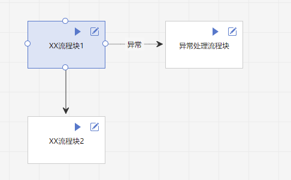
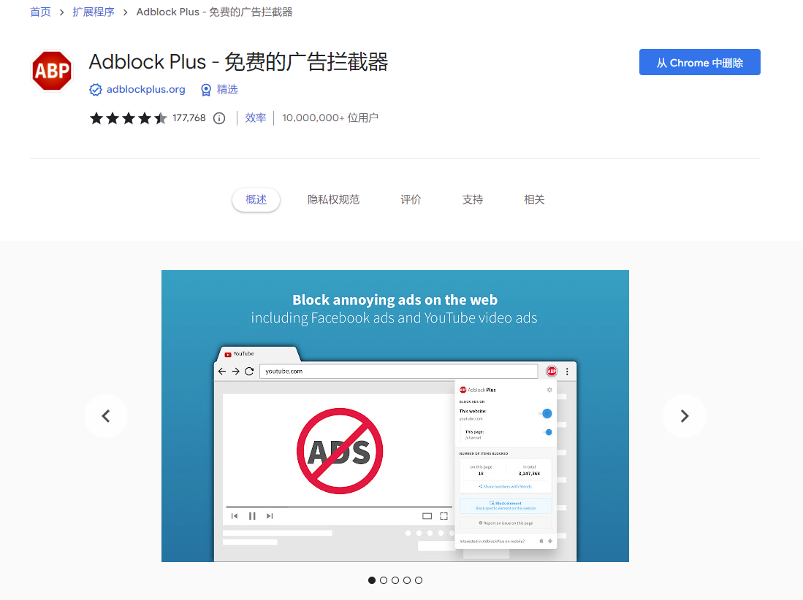
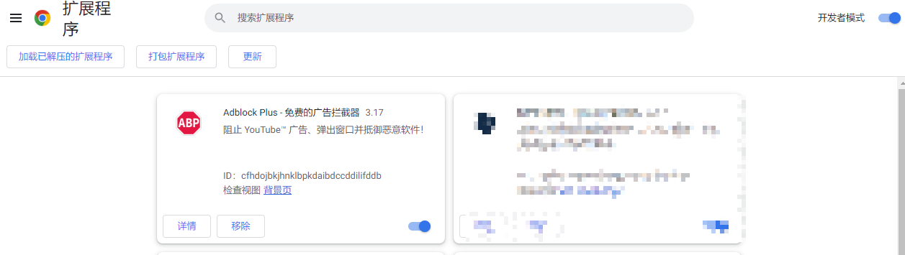

目录

- [1. 前言](#1-前言)
- [2. 基础概念](#2-基础概念)
  - [2.1. 典型的RPA项目过程](#21-典型的rpa项目过程)
  - [2.2. 名词解释](#22-名词解释)
- [3. 需求管理](#3-需求管理)
  - [3.1. 需求变更控制](#31-需求变更控制)
  - [3.2. 需求分析注意事项](#32-需求分析注意事项)
- [4. 风险管理](#4-风险管理)
  - [4.1. 风险识别](#41-风险识别)
  - [4.2. 风险跟进](#42-风险跟进)
  - [4.3. 常见风险概述（待更新）](#43-常见风险概述待更新)
- [5. 干系人管理](#5-干系人管理)
- [6. 程序设计](#6-程序设计)
  - [6.1. 流程图](#61-流程图)
  - [6.2. 命名规则](#62-命名规则)
  - [6.3. 模块划分](#63-模块划分)
    - [6.3.1. 模块划分总体原则——高内聚、低耦合](#631-模块划分总体原则高内聚低耦合)
    - [6.3.2. 模块划分的好处](#632-模块划分的好处)
    - [6.3.3. 划分模块时的考量因素](#633-划分模块时的考量因素)
    - [6.3.4. RPA软件中可以用于划分不同层级模块的功能](#634-rpa软件中可以用于划分不同层级模块的功能)
    - [6.3.5. 良好的模块化RPA程序是什么样子](#635-良好的模块化rpa程序是什么样子)
  - [6.4. 异常处理](#64-异常处理)
    - [6.4.1. 异常类型区分](#641-异常类型区分)
      - [6.4.1.1. 程序运行过程中发生的「技术异常」](#6411-程序运行过程中发生的技术异常)
      - [6.4.1.2. 违反业务逻辑产生的「业务异常」](#6412-违反业务逻辑产生的业务异常)
    - [6.4.2. 异常处理方式](#642-异常处理方式)
    - [6.4.3. 异常处理方式的考量因素](#643-异常处理方式的考量因素)
    - [6.4.4. RPA软件中可以用于异常处理的功能](#644-rpa软件中可以用于异常处理的功能)
  - [6.5. 库的使用](#65-库的使用)
    - [6.5.1. RPA软件中的库是什么](#651-rpa软件中的库是什么)
    - [6.5.2. 使用库能带来的好处](#652-使用库能带来的好处)
  - [6.6. 日志](#66-日志)
    - [6.6.1. 日志的等级](#661-日志的等级)
    - [6.6.2. 记录不同等级日志的好处](#662-记录不同等级日志的好处)
    - [6.6.3. 日志内容](#663-日志内容)
    - [6.6.4. 其他良好的日志习惯或注意事项](#664-其他良好的日志习惯或注意事项)
  - [6.7. 配置与代码分离原则](#67-配置与代码分离原则)
  - [6.8. 其他程序设计的细节考虑](#68-其他程序设计的细节考虑)
    - [6.8.1. 事务性数据的设计](#681-事务性数据的设计)
      - [6.8.1.1. 处理进度的持久化](#6811-处理进度的持久化)
      - [6.8.1.2. 事务项之间避免干扰](#6812-事务项之间避免干扰)
    - [6.8.2. 界面操作的结果验证](#682-界面操作的结果验证)
  - [6.9. 一定要避免的糟糕坏习惯](#69-一定要避免的糟糕坏习惯)
- [7. 版本控制](#7-版本控制)
- [8. 对应不同场景的软件工具推荐](#8-对应不同场景的软件工具推荐)
  - [8.1. Chrome浏览器广告屏蔽插件：Adblock Plus](#81-chrome浏览器广告屏蔽插件adblock-plus)
- [9. 许可证](#9-许可证)

# 1. 前言

嗨，这里是我的RPA项目管理笔记，以总结分享个人在RPA项目过程中的管理经验为主，也会包含少量技术经验。

目前个人接触过的RPA软件包括UiBot，Encoo，UiPath，由于不同软件的特性会导致某些管理经验的适用性不同，对于这种情况，我会特别标注出来。

本人在小型乙方公司中参与中小型项目开发，管理经验来自于个人书本学习和项目完成后的反思总结，因此无法适用于所有RPA业务场景，很多观点甚至可能是偏颇的，请见谅。个人估计本笔记对中小型企业的RPA从业者的帮助会更大些。笔记中所涉及各种场景，也主要从乙方工程师的视角来阐述（所以笔记中一般「我方」就等于「乙方」，「对方」就等于「甲方」）。

如果读者有任何疑问或意见，欢迎在本笔记发布的平台留言，我会尽量给予有建设性的回复。

希望达成的目的：

* 记录与展示个人的工作、学习成果，帮助职业发展；
* 帮助经验尚浅的RPA从业者避免一些弯路（一些对于初中级工程师可能比较陌生的词，我会在括号内给出简短解释；以及有时担心讲得不够浅显，文字有些啰嗦，请见谅）；
  * 个人认为，管理也是一门技术，纯开发的技术工程师应当掌握一定的管理知识，获得在沟通、效率、协作、决策上的好处，使自己的项目过程愉快一些。
* 锻炼自己的英文写作。

RPA行业还在高速发展中，如果随着时间发展，本笔记可以在此行业留下一些痕迹，帮助到一些工程师，那将会是一件十分有成就感的事情。（如果在此之前，大部分RPA岗位已经被通用AI取代，那只能祝我们好运了）

本笔记在以下三个平台发布：

* GitHub（中文）：[https://github.com/HUHARED/rpa_project_management_notes/blob/main/README.md](https://github.com/HUHARED/rpa_project_management_notes/blob/main/README.md)
* UiBot社区：[https://forum.laiye.com/thread-30110.htm](https://forum.laiye.com/thread-30110.htm)
* GitHub(English)：[https://github.com/HUHARED/rpa_project_management_notes/blob/main/README_en.md](https://github.com/HUHARED/rpa_project_management_notes/blob/main/README_en.md)
* UiPath Forum：[https://forum.uipath.com/t/my-rpa-project-management-notes/541120?u=huha](https://forum.uipath.com/t/my-rpa-project-management-notes/541120?u=huha)

在我认为值得分享的管理知识枯竭之前，计划本笔记每月至少更新2次，总字数2万+。

本笔记的更新以GitHub为主，并适时同步到其他平台。

欢迎在以上平台进行留言讨论，谢谢。

如果读者对UiBot技术方面感兴趣，也可阅读本人的UiBot技术笔记：[【笔记分享】个人UiBot使用经验、笔记、技巧分享](https://forum.uibot.com.cn/thread-12458.htm)

# 2. 基础概念

为了使未专门接触过项目管理的RPA工程师能更好的理解接下来的内容，我们先来了解一些基础概念。

受限于个人经验，笔记中对于这些基础概念的解释，可能与专业领域的定义有一些差别。

## 2.1. 典型的RPA项目过程

1. 项目启动之前
   1. 在项目经理了解到这个项目之前，公司的销售、市场团队通常已经完成了对潜在客户的调查研究、意向洽谈等工作。
2. 项目启动
   1. 项目经理、业务分析人员、程序设计人员、程序实施人员、客户等等干系人通过邮件、聊天软件、视频会议等工具，分析、明确这个项目的任务范围（要做哪些事情，做到什么程度）、需要哪些资源（人力资源、软硬件资源等）、可能存在什么风险、报价（常见的有固定价格、按每个周期人天计费等）等等。
3. 业务分析、程序设计
   1. 对要自动化的业务进行详细分析，构建流程图等，做出程序总体、细节设计。
4. 程序实施、测试
   1. 实施工程师根据程序设计资料进行RPA程序的实施工作。
   2. 按照我所接触的情况而言，通常测试工作也由实施工程师负责。
5. 部署和系统测试
   1. RPA程序通过了在开发环境的集成测试后，就需要在客户执行的实际生产环境进行部署了，包括安装RPA软件、浏览器、Excel等。
   2. 部署完成后，在实际生产环境运行整体程序，观察运行结果是否符合预期，也就是系统测试。
6. 用户培训、产品验收
   1. 如果系统测试没问题，根据需要，可能需要为客户进行程序日常使用、维护的培训，而如果客户自己没有IT人员，可能会要求将产品后续的长期运维也交于我方，自然也就不牵扯到培训工作。
   2. 当用户确定对我方提供的程序满意，则双方进行产品验收工作，包括对验收报告签字，按合同约定打款等。
7. 经验总结
   1. 项目团队内部总结本次项目过程中各种管理、技术方面经验，形成文档资料供后续同类项目参考。
8. 程序运维
   1. 如果约定了提供运维服务，那么在约定的运维周期内，由运维工程师（通常也可能是实施工程师担任）进行程序的日常运维工作，通常包括
      1. 业务流程涉及的界面如果发生了影响程序运行的变化，对程序的界面操作逻辑进行修改；
      2. 程序要处理的数据格式发生了变化，对数据处理逻辑进行修改；
      3. 客户对程序有新的需求，如果需求很容易实现，那么在运维工程师的权限范围内，可以直接修改程序，满足客户需求，如果需求可能要花费很多成本（占用较多时间、人力来进行分析、实施工作），则可能需要商务人员介入，沟通是否要签订增补合同，收取额外费用。
   2. 运维周期将要结束时，联系相关干系人，询问运维延期还是按照预期时间停止运维。

## 2.2. 名词解释

* 人天：项目工作量的一种计量方式，通常指一个工程师在8个小时（法定的一天工作时长）可完成的工作量。
* 单元测试：对程序代码中一小部分（比如UiBot的一个子程序、流程块，UiPath和Encoo的一个子流程、序列）进行测试。目的是验证当前这部分代码的功能是否正确。
* 集成测试：将单元测试通过的组件组合在一起进行测试，看它们能否正确的协同工作。
* 系统测试：在程序预期要运行的系统中，对整个程序进行全面测试，观察程序是否能满足预期的需求。
* 用户验收测试：在RPA程序交付之前，由实际用户进行的测试。观察程序能否让客户在真实的业务场景中正常工作。
* 甲方：指的是项目过程中提出需求、付钱的客户公司、人员。
* 乙方：指的是项目过程中满足甲方需求、收钱的公司、人员。

# 3. 需求管理

## 3.1. 需求变更控制

项目开发过程中，可能遇到客户新增、变更需求的情况，高效的项目管理过程应当注重对客户提出的需求变更进行控制。

在说明原因之前，我们应该了解以下前提：

* 甲乙双方约定的项目报价，很多情况下是以人天为单位计算出来的，比如一个项目涉及到一个产品经理、若干个高级工程师、若干个中级工程师，计算分别需要花费每个人员多少天的时间，然后给出一个具体报价、约定什么时间给出最终产品。
* 在明确了任务总体范围之后，才能做出相对合理的人天估算。
* 在甲方确认项目约定的任务已完成之前，乙方实际花费的人天越少，自然盈利越多。

那么，之所以要进行需求变更控制（避免直接接受客户所提出的需求变更），可以概括为以下原因：

* 保持项目范围明确、降低风险：
  * 项目范围的增加意味着要付出额外的人天成本，且新需求之前可能没有进行过可行性验证，那么可能带来未知风险，增加乙方所承担的成本（降低了盈利）。
* 确保项目不偏离计划时间、保持项目质量、提高客户满意度：
  * 需求变更可能意味着之前进行的程序设计工作要进行额外改动，影响项目最终成果的预期质量、预计完成时间。
  * 对需求变更可能存在的新风险、导致项目上线时间推迟、需求本身的可行性等与客户进行沟通，获取客户的理解和支持，避免减少客户对我方感到不满的可能性。
* 保持团队士气：
  * 频繁的需求变更可能导致我方团队士气低落，因为成员可能感到自己的努力被浪费。

那么在了解到进行需求变更控制的必要性之后，可参考以下步骤进行需求变更控制工作：

1. 在项目启动阶段，约定甲乙双方有权提出需求变更、有权确定需求变更的人。
   1. 为了避免随便什么人都对项目指手画脚，干扰项目高效运行，有必要在项目前期就明确相关权责。
   2. 由专人进行沟通，可以减少多方联络时，因为对项目的业务、技术了解情况不同而造成的额外沟通成本。
   3. 人选标准建议：
      1. 甲方的有权提出需求变更的人员，通常建议选择熟悉本项目所涉及的各种业务的人员，或者与相关业务人员能进行有效沟通的人。这样主要是为了减少在用户验收测试阶段，程序使用者发现程序在真实业务场景下与自己的预期效果差距大的可能性。
      2. 甲方的有权提出需求变更的人员，通常建议选择被客户方领导授权过的业务人员，或者客户方领导。
      3. 乙方有权提出、确认需求变更的人员
         1. 如果是中大型项目，需要多个实施工程师同时负责不同业务模块的实施，则建议是专门指派一个人，作为需求专员。需求专业在项目前期负责与甲方沟通，编写需求文档，实施工程师根据程序设计文档、需求文档实施时如果遇到问题（比如某些需求不够清晰、难以实现），首先与需求专员进行沟通，需求专员完全理解了之后，需求专员再与客户需求控制人员沟通。
         2. 如果是小型项目，则可以由实施人员兼任需求沟通、确认工作。
2. 明确变更的代价
   1. 每次提出需求变更，我方都要和对方明确这个变更可能付出的代价：
      1. 时间成本
      2. 对程序质量的影响
      3. 可能遇到未知风险导致交付时间延误等
   2. 明确阐述代价不是为了要客户额外付费（当然有额外付费更好），而是要为可能因需求变更导致的程序质量问题、延期获取客户的理解，即使需要额外付费，或者项目效果未达到预期，客户一般能一定程度上体会到我们的苦劳。
3. 记录需求变更到文档
   1. 还在沟通过程中、已经确认要进行的、已经确认取消的需求变更，都要尽量记录到文档中，出现矛盾后可作为评判责任的依据。
   2. 建议优先使用聊天软件提供的在线文档，方便各方查阅、编辑，最后也可作为项目交付文件。
   3. 文档格式可参考下面的表格自行创建，或将这个在线腾讯文档（[【腾讯文档】XX项目-需求管理清单](https://docs.qq.com/sheet/DR2hDVWlNRlJoQWtB?tab=BB08J2)）创建副本到自己的帐号中：

| 记录日期       | 类别     | 所属流程 | 需求描述 | 之前需求描述 | 预估消耗人天 | 提出人 | 状态   | 确认人 | 备注 |
| -------------- | -------- | -------- | -------- | ------------ | ------------ | ------ | ------ | ------ | ---- |
| 20XX年XX月XX日 | 需求新增 | 流程1    |          |              |              |        | 确认   |        |      |
| 20XX年XX月XX日 | 需求变更 | 流程2    |          |              |              |        | 沟通中 |        |      |
| 20XX年XX月XX日 | 需求变更 | 流程2    |          |              |              |        | 否决   |        |      |

## 3.2. 需求分析注意事项

* 要理解业务流程的详细步骤，并经过关键干系人确认

  * 需求分析过程一定要有熟悉业务流程的客户方员工的积极参与。
    RPA团队内负责需求分析的工程师在与客户沟通并梳理需求的过程中，要整理出来流程图和流程过程说明，经过客户方、开发工程师等干系人确认**详细、清晰、无歧义**之后，再进行后续的程序设计等工作。
  * 如果本来就没有成熟的人工操作流程可以参考，那么需求分析工作就需要需求分析工程师、客户方、程序设计工程师、程序实施工程师尽量多的一起进行分析。
    尽可能详细地梳理步骤（界面操作过程要尽量人工操作一遍完整过程，避免遗漏重要步骤），寻找风险因素。
    因为**越早发现问题，解决问题的成本就越低**，在没有人工操作流程、过往同类项目可参考的情况下，就尤其重要。
* 要整理流程图、流程说明等需求文档

  * 一方面这些文档可以用于划分责任，另一方面，可以用于后续同类项目参考。
* 留意和需求范围相关的关键词

  * 对于需求中「全部、所有」这类词，要明确数量、时间的边界。
    比如是某些抓取数据需求，客户提出要抓取某个界面的「全部」数据，那么就需要明确「全部」指当前一整页结果，还是所有可以翻页访问到的结果，以及日期截止到昨日还是什么时候。
* 要明确数据输入、输出的格式、存储方式

  * RPA要处理的数据是什么格式（数据库查询、Excel等）
  * RPA处理产生的数据是什么格式，保存到哪里（保存到文件夹的话，在文件夹、文件名称设计上，要考虑区分日期、帐号等）。
* 要充分考量同类项目的需求

  * 过往的同类项目：在进行需求分析时，要考虑到过往同类项目有哪些类似需求、遇到了哪些问题。
  * 未来的的同类项目：考虑本项目的需求范围、目标等是否可以进行一些改动，使未来业务团队再接手同类项目时，能更好的利用本项目的成果，

# 4. 风险管理

## 4.1. 风险识别

任何可能导致项目的目标（包括范围、时间、成本、质量）偏离预期的事情，都算是风险。

给风险分类的话，则包括技术风险（软件兼容性、实施难度等）、业务风险（如业务流程变更、合规性等）。

对待风险的正确态度是尽量提早识别风险并制定应对措施，因为越是到项目后期再发现新问题，导致的损失往往越大。

为了提早识别项目风险，制定风险对应措施，减少因风险导致的返工、项目拖延问题，可以参考该风险核对单，根据项目场景，来了解之前同类项目遇到过哪些风险、有什么应对措施。

风险核对单应该是随着业务团队对不同项目的参与而持续补充修订的，建议每次项目完成后都通过团队内部召开会议等方式总结风险识别和应对过程，更新风险核对单。

风险核对单文档格式可参考：

| 更新日期       | 场景一级分类 | 细分场景             | 需注意风险说明                                                                                                                             | 参考项目     | 参考应对措施                                                                                                                                                                                                                                                                                                                  | 编辑人 |
| -------------- | ------------ | -------------------- | ------------------------------------------------------------------------------------------------------------------------------------------ | ------------ | ----------------------------------------------------------------------------------------------------------------------------------------------------------------------------------------------------------------------------------------------------------------------------------------------------------------------------- | ------ |
| 20XX年XX月XX日 | 登录         |                      | 需注意登录是否需要手机、邮箱来接收验证码                                                                                                   |              | 手机验证需要客户在手机上安装APP，并在服务器上部署验证码收发程序（如果手机不在内网环境，则还需要服务器有公网IP），客户可能不愿意手机安装软件，以及总体而言工作量比邮件方法大，且部分手机系统对验证码监听软件兼容性差。 因此优先建议客户改为邮箱验证，需注意邮箱需要支持协议连接（有的客户因网络管理要求，不允许协议链接） | 某某   |
| 20XX年XX月XX日 | 登录         | 抖音平台抖店网页登录 | 登录帐号时，可能需要滑块拼图验证。                                                                                                         | 某某电商项目 | 使用Python的OpenCV库计算滑动偏移值。具体参考技术文档知识库。                                                                                                                                                                                                                                                                  | 某某   |
| 20XX年XX月XX日 | 登录         | 抖音平台抖店网页登录 | 登录帐号时，可能需要手机或邮箱验证码                                                                                                       | 某某电商项目 | 单一客户帐号，则在保持每天都访问网页的情况下，一般不会自动退出帐号，也就不涉及验证码问题。 如果必须使用帐号密码登录，建议使用邮箱作为用户名，获得邮箱密码，使用IMAP协议连接邮箱来获取验证码。                                                                                                                            | 某某   |
| 20XX年XX月XX日 | 数据库       | 数据库连接           | 需要注意客户提供的数据库是否需要通过SSH通道等方式进行连接，RPA软件内置组件不支持。                                                         | 某某电商项目 | 使用Python的sshtunnel库                                                                                                                                                                                                                                                                                                       | 某某   |
| 20XX年XX月XX日 | 沟通         | 客户无专职IT         | 当客户没有专职IT时，出现云服务器、第三方网站等问题时，如果让客户对接人进行联系相关客服沟通（一般是个业务领导或业务员），可能沟通效率非常低 | 某某电商项目 | 对应这种情况，如果时间紧张，建议经客户授权、规避其他责任风险后，由我方联系相关第三方服务商客服。                                                                                                                                                                                                                              | 某某   |

项目启动阶段，应该联系相关干系人，使用参考风险核对单、询问干系人意见等方式，产生本项目的风险登记表，来记录、追踪项目风险。

制定具体的风险应对措施时，通常从以下几方面考虑：

* 规避：改变项目计划，使风险本身不可能出现。
* 降低：采取措施减少风险发生时的影响，或降低风险发生概率。
* 转移：将风险转移给第三方，比如保险、合同分包等。
* 接收：有意识的接受风险，并为可能的影响做好准备。

制定好风险对应措施后，指定责任人，确保有专人负责监控和管理对应风险，并根据项目实际进展来调整风险应对措施。

风险登记表文档格式可参考：

| 创建日期 | 更新日期 | 是否关闭 | 风险说明 | 风险影响 | 应对措施 | 责任人 |
| -------- | -------- | -------- | -------- | -------- | -------- | ------ |
|          |          | 关闭     |          |          |          |        |
|          |          | 未关闭   |          |          |          |        |

或者将这个在线腾讯文档（[【腾讯文档】XX项目-风险跟踪表](https://docs.qq.com/sheet/DR1lBckFNc0VBd3VY?tab=BB08J2)）创建副本到自己的帐号中。

## 4.2. 风险跟进

在整个项目过程中，都要持续监控已经识别的风险和对应措施的执行情况。

项目管理人员可以通过定期项目会议、报告等方式，确保风险管理信息被及时更新和通知到相关干系人，并识别新出现的风险，将其更新到风险登记表中。

在项目结束后，对本次项目风险管理过程进行评估，总结经验教训，将可以用于后续项目的处理方案记录到风险核对表等文件中。

## 4.3. 常见风险概述（待更新）

# 5. 干系人管理

当项目中各方涉及人数大于等于5个人时（举例来说，一个项目最少会有这4个人：甲方领导、甲方业务员、我方商务、我方RPA工程师），人数越多，越有必要整理出一份干系人清单。

干系人清单对项目中途接手、加入的人来做作用很大：

* 了解本项目中不同人的姓名（或称呼）
* 明确每个人的权责（哪方面有问题该找谁）。
* 记录联系方式（微信、电话、邮箱等）。
* 记录干系人的性格、有效交流方式、沟通雷区。
  * 比如某些甲方的领导特别厌恶工程师对Ta说「这个肯定做不到、这不是我的工作」，如果还打算和对方合作的话，就需要避免这种雷区。

干系人清单文档格式可参考：

| 干系人类别       | 干系人名称 / 称呼 | 干系人职责 | 联系方式 | 备注 |
| ---------------- | ----------------- | ---------- | -------- | ---- |
| 客户方领导       |                   |            |          |      |
| 客户方业务员     |                   |            |          |      |
| 客户方IT         |                   |            |          |      |
| 合作商领导       |                   |            |          |      |
| 合作商IT         |                   |            |          |      |
| 内部团队领导     |                   |            |          |      |
| 内部团队成员     |                   |            |          |      |
| 内部团队项目管理 |                   |            |          |      |

或者将这个在线腾讯文档（[【腾讯文档】XX项目-干系人登记表](https://docs.qq.com/sheet/DR0JHR1BodnlJY1Nx?tab=BB08J2)）创建副本到自己的帐号中。

# 6. 程序设计

## 6.1. 流程图

除非是个人使用的临时的、小工具性质的程序，否则都建议将画流程图作为「理清需求」之后、「程序设计」之前的过程。

流程图可粗可细，可选软件或网站也很多（Microsoft Visio、Draw.io、亿图图示、processon，或者手绘当然也是一个选择），只要能够方便自己、其他干系人分享、理解就行。

在写RPA程序之前，先画流程图的普遍意义是这样的：

* 自己梳理需求：对需求所对应的程序操作步骤、数据流转有比较概括的梳理，有助于理解需求、发现现有需求分析中还不明确的地方。
* 使别人理解程序的运作过程：和单纯的文字、语言沟通相比，使用流程图通常有助于对方更快的理解自己想要表达的意思。
* 作为项目书面资料：
  * 项目完成后，如果要将程序交给其他工程师运维，有关于程序框架、不同模块运行逻辑的流程图的话，会让接手程序的运维工程师更快的理解程序，减少运维成本
  * 很多乙方公司的业务团队会专注于某些具体的垂直领域，比如电商、物流、财务等等，那么不同的项目其实都有很多共性、程序很多部分可以经过少量修改后复用，那么在复用之前项目的程序时，有流程图就可以降低理解成本。

## 6.2. 命名规则

在说明RPA项目适合什么样的命名规则之前，我们需要先对不同编程语言对变量类型处理的「动态、静态」（Dynamic vs. Static）、「强、弱」（Strong vs. Weak）有个大概了解。

请参考知乎回答：[弱类型、强类型、动态类型、静态类型语言的区别是什么-哥舒夜带刀的回答](https://www.zhihu.com/question/19918532/answer/1090175567)

注意这不是精确的技术定义、在不同场景下经常被混淆，觉得难以理解也没关系，而且每种编程语言即使被归类为某一种类型，也不代表着它具备所有的类型特征。

图片出处：[Should Your Start Up Go Static or Dynamic?](https://dustyprogrammer-blog.tumblr.com/post/16746798643/should-your-start-up-go-static-or-dynamic)

然后，我们再来了解一下有哪些常见的命名风格：

* 驼峰命名法：每个单词之间没有间隔，通过每个单词的首字母大写来区分。
  可以再细分为大驼峰（CamelCase）、小驼峰（camelCase），后者的第一个单词首字母是小写。
  大驼峰命名法也就是PascalCase。
* PascalCase：包括第一个单词在内，所有单词首字母都大写。
* 蛇形命名法（snake_case）：所有单词之间使用下划线（ _ ）来连接。
* 烤串命名法（kabab-case）：所有单词之间使用短横线（ - ）来连接。

一些好的命名习惯：

* 在命名参数时，体现参数的传递方向（如果读者对参数和变量的区别不清楚，那么可以简单的理解「传给函数、函数返回的变量，就是参数」）。
  在UiPath、Encoo中保持这种命名习惯会有利于检查代码。
  UiPath、Encoo中的参数传递方向有3种，推荐在变量开头使用这几种文本：

  * in：表示这个参数是调用xaml文件时传入的。
  * out：表示这个参数是xaml文件运行完成时传出的。
  * io：表示这个文件被传入后又被传出。
* 使用有意义的名字：当我们创建变量时，RPA软件会给出「result、text、sRet、object/item」等名称，这些名称的含义过于宽泛了，如果我们将代码给别人解释，或者自己过几个月需要调整自己的代码，那么这种名称就不利于快速理解变量的作用。
  应当给变量 / 参数一个有清晰含义的名称，比如：学生姓名、总薪资、studentName、totalSalary。
* 在命名中提现变量 / 参数的类型：对于UiPath、Encoo这种基于VB / C#，对变量类型绑定有严格限制的RPA软件，建议在命名中包含提现类型的文本，有助于理解程序、减少类型冲突错误（而UiBot对更改变量类型绑定无限制，所以本条命名习惯的重要性不高），比如：

  * 字符串类型

    * strWebText
    * 网页文本
    * strName
    * 姓名文本
  * 整数类型

    * intTotalCount
  * 字典类型

    * dictConfig
    * 配置字典
  * 布尔值类型

    * isAvailable
    * hasPaid
    * canExecute
    * 是否元素存在
    * 是否已完成
    * 是否包含目标文本

一些应当避免的命名坏习惯

* 避免使用软件保留的关键字：如Int、Double、String等。
* 避免使用特殊字符：现在很多RPA软件都支持在变量、函数名称中使用UTF8字符，但是为了避免兼容性问题，还是建议优先使用常用汉字、ASCII字符命名字符。
* 避免使用汉语拼音：使用汉语拼音命名太难以理解、容易产生歧义、和英文单词混淆，如果读者的英文不好，就使用汉字命名即可，常见的RPA软件都支持，笔者个人实在是想不到什么合理的理由去使用汉语拼音。

UiBot很大程度上是基于Python二次开发的，UiPath、Encoo很大程度上是基于C#二次开发的，因此我们就可以根据Python、C#的不同特性，来区分使用不同RPA软件时，优先选择的命名习惯。

在这里给出我个人的命名习惯供读者参考：

* UiBot
  * variables: lowerCamelCase
  * arguments: direction(g/in/out)+lowCamelCase
  * functions: snack_case
  * blocks: UpperCamelCase
* UiPath/Encoo
  * variables: lowerCamelCase(withType)
  * arguments: direction(in/out/io)+lowCamelCase(withType)
  * functions: snack_case
  * folders: UpperCamelCase

如果RPA程序需要获取客户内部系统的数据，需要客户IT部门提供接口，那么我方需要尽早和客户方IT团队约定接口、参数的命名规则，并同步到文档中，避免双方开发过程中出现因参数命名不一致导致矛盾。

## 6.3. 模块划分

在进行具体的RPA代码编写之前，为了使程序有一个清晰的结构，降低复杂度和出错后的调试成本，我们应当按照从顶层到底层的方向，从不同层级规划我们的程序包含哪些模块。

### 6.3.1. 模块划分总体原则——高内聚、低耦合

即模块内部的功能应该尽可能的紧密相关，不同模块之间的依赖关系应该尽可能的简单。

### 6.3.2. 模块划分的好处

* 使程序具备良好的可维护性、可扩展性

  * 因为模块之间彼此独立，某一层不需要知道它的下一层是如何实现的，只要按照约定进行调用即可。模块内部只需要考虑自己负责的功能，按照合适的方式解决。
  * 当某个模块内部尽快修改时，只要接口关系不变，那么调用它的模块就不会受到影响，不需要一起修改。
  * 某个模块不再需要时，可以直接去掉它。
* 方便进行单元测试

  * 问题在越小的模块、越早期被发现，解决成本就越低，当问题只能被定位到模糊的大范围内、在项目后期被发现，解决成本就越高。
* 促进标准化

  * 很多乙方公司的业务团队会专注于某些具体的垂直领域，比如电商、物流、财务等等，不同的项目其实都有很多完全一致的需求，那么就可以将对应功能的接口标准化，封装到功能库中（UiBot叫做命令库、UiPath叫做Library、Encoo叫做组件库），新项目可以直接调用。
* 有利于团队间分工开发

### 6.3.3. 划分模块时的考量因素

* 上游过程产生的流程图、需求设计文档。
* 功能划分

  * 根据业务流程中不同功能，来进行模块划分。比如一个电子邮件管理RPA程序，可能就会有「读取邮件」、「筛选邮件」、「发送邮件」几个功能。
    那么我们就可以考虑在UiBot的不同流程块、UiPath / Encoo的不同文件夹或xaml中实现上述功能。
* 数据类型划分

  * 比如一个RPA程序需要对不同类型的订单文件进行处理，那么我们可以将每种类型的数据处理过程放到对应的函数、文件夹中。
* 先后步骤划分

  * 按照业务流程的先后顺序，将整个程序划分为一系列的模块。
* 涉及软件划分

  * 比如一个RPA程序要对网页、客户端、数据库、Excel等进行操作，那么就可以将先划分文件夹，然后将不同软件的操作过程放到对应文件夹中。
    对于UiPath / Encoo这样内置文件夹架构的RPA软件来说，这很好理解，而UiBot则可以让一个内部定义了若干函数（子流程）的流程块充当文件夹。
* 模块的复用性（是否可以被多次使用）

  * 被多次使用的功能、步骤，尤其应该被封装为函数。
* 模块的复杂度（界面操作、数值运算数量）

  * 操作数量越多，就越应该考虑将步骤拆分到不同子模块中。
* 未来需求变更的可能性

  * 当一部分功能所对应的情况可能在未来会有变化时，就应当优先考虑将其单独作为一个模块。这样对应功能就可以用较低成本进行修改，适应新的情况，而不需要对整个程序进行大范围的修改。
* 团队的技术能力

  * 当团队合作开发时，可能需要避免使用其他成员几乎不了解的技术，确保团队成员能够理解、实现模块的设计。

### 6.3.4. RPA软件中可以用于划分不同层级模块的功能

RPA工程师们可根据需要使用，越靠前的功能通常对应更顶层的模块划分。

* UiBot
  * 流程块（注意流程块内的函数（子程序）是可以被其他流程块调用的，调用方式：源代码视图中，**返回值=流程块名称.子程序名称(参数)**）
  * 函数（子程序）
* UiPath / Encoo
  * 文件夹
  * xaml
  * 流程图 / 序列

### 6.3.5. 良好的模块化RPA程序是什么样子

每个流程块（UiBot的.task文件，UiPath / Encoo的.xaml文件）、函数、流程图 / 序列，都尽量「原子化」，也就是说包含了非常单一的目的，以及尽量少的操作数量。（如果发现一个流程文件的操作数量比较多，那么我们应当考虑这个模块是不是应该被拆分了）

这样可以清晰的表达、理解从宏观到细节的各个层次的功能，并分别实现他们。

以及，这样非常方便进行单元测试，有效减少为了测试一小块功能，而必须先运行再次之前的一大堆流程的情况。（测试当前模块时，如果需要上游流程的数据，应该使用UiBot的UnitTest命令、UiPath的Mocking来给出模拟值）

## 6.4. 异常处理

由于网络问题、界面变更等原因，RPA程序可能会运行出错，一个可靠的RPA程序应该可以对不同的错误（异常）情况进行合适的处理。

### 6.4.1. 异常类型区分

我们先来了解一下RPA程序中发生的异常可以分为哪些类别。

#### 6.4.1.1. 程序运行过程中发生的「技术异常」

技术异常指的是我们写的RPA程序语法正确，程序也按照正确的业务过程在运行，但是运行过程仍然出错了，常见的技术异常包括：

* 元素找不到，比如因为网络缓慢、界面有变更等原因）
* 数值为空，比如某些数值还没有被正确的赋值（Python中的None，UiBot / UiPath / Encoo / 数据库中的Null），就被使用了，就可能发生异常。
* 计算异常，比如尝试除以一个值为0的变量，就会发生一个ZeroDivisionError。
* 等等

#### 6.4.1.2. 违反业务逻辑产生的「业务异常」

RPA是自动化办公的技术，业务异常指的「程序处理过程中，遇到的违反业务规定」的情况，比如

* 某个金融风险的程序，业务规定「遇到超过10000元，客户IP地址不在国内」的情况，就不应该让RPA程序自动处理，应该交给人工来判断。
* 某个报销处理程序，业务规则要求遇到超过10000元的申请就交由人工处理，那么可以在金额超过10000元时，抛出一个可读性高的自定义异常（比如把异常文本设置为”当前报销申请金额超过10000元”）。
* 某个表格填报程序，业务规定某些内容是必填项，那么RPA程序在读取表格内容后，就需要判断对应的值是不是空字符串，如果是空字符串，就抛出一个自定义的异常。

### 6.4.2. 异常处理方式

遇到技术异常、业务异常时，总体而言处理异常的方式有以下几种：

* 忽略
* 重试
* 记录
* 通知
* 回滚

### 6.4.3. 异常处理方式的考量因素

不同异常所需要的处理方式自然是不一样的，在这里讲解一些考量因素：

* 不影响程序运行、不违反业务规定的异常，可以刻意**忽略**它。比如，某个程序要对大量同类数据进行处理，为了监控进度，在每条数据处理完成后，添加了一个钉钉通知步骤，但是偶尔因为聊天软件的服务器网络问题、或者对聊天软件对发送消息频率的限制，导致没有发送成功，那么没必要重试，继续正常运行即可。
* 我们可以将RPA所有的操作，都概括为「界面操作」与「逻辑处理」。
  界面操作指的是对网页、应用软件等图形化窗口进行鼠标、键盘操作，逻辑处理指的是进行各种数据运算、判断。
  在网页、应用程序的**界面操作**过程中，如果有时网络问题网页加载不全导致RPA程序没有找到预期的界面元素，或者有不定期出现的弹框遮盖了要点击的界面元素，这种情况可能多等几分钟、刷新下网页就可以了。那么对于这种情况，我们可以选择**重试**对应的界面操作过程。
  而**逻辑处理**过程，因为通常在同样的运行环境中执行相同步骤产生的结果是一致的，所以一般没必要对异常进行重试。
* 对于各种异常，都应当将其**记录**。
  * 根据需要，异常被记录后，可以在重新抛出，用于中断程序运行，或者由上层流程再处理。
  * UiBot具备成熟的源代码视图，异常记录时会包含对应代码行，非常的方便。
    而UiPath、Encoo由于没有成熟的源代码视图，所以给每个活动（Activity） / 组件（Component）一个容易理解的名称就非常重要，否则报错时甚至很难快速判断是哪里出了问题。
* 有的异常可能需要运维工程师及时处理，那么可需要考虑在捕获异常后，通过聊天软件、邮件等方式，**通知**到责任人。
* 发生异常时，如果有些数据已经处理了，但是业务规则要求「要么所有数据都处理完成，要么都不处理」，那么我们就应该在捕获异常后，增加**回滚**操作，将已经处理过的数据状态恢复原状。这种情况最常见的是数据库操作过程，我们可以将所有的数据库操作放在一个事务（Transaction）中来实现「异常时自动回滚本次事务过程的所有操作」。

### 6.4.4. RPA软件中可以用于异常处理的功能

* UiBot

  * [异常捕获（Try Catch）](https://documents.laiye.com/rpa-command-manual/docs/Grammar/TryCatch)
  * [异常重试](https://documents.laiye.com/rpa-command-manual/docs/Grammar/TryNCatch)
  * 拖拽异常箭头，指向专门用于异常处理的流程块
    * 当我们在一个流程块边缘拖拽产生流转方向箭头时，第一个箭头表示「正常处理结束后会流转到哪里」，再次拖拽就会产生异常箭头，表示「流程块发生没有被捕获的异常时会流转到哪里」
    * 
* UiPath

  * [Try Catch](https://docs.uipath.com/activities/docs/try-catch)
  * [Retry Scope](https://docs.uipath.com/activities/docs/retry-scope)
  * [global-exception-handler](https://docs.uipath.com/studio/docs/global-exception-handler)
* Encoo

  * [Try Catch](https://academy.encoo.com/wiki/Activities/JudgeLoop/Senior/TryCatch.md?uuid=48b2d381-2ebc-4611-85eb-5b6ea87ae5aa)
  * [重试](https://academy.encoo.com/zh-cn/wiki/Activities/WorkflowControl/Retry.md?_v=v2020.1&uuid=3a5ca6b3-47d9-4e27-b4a0-91abe47b59bb)
  * [ErrorHandler.xaml](https://academy.encoo.com/zh-cn/wiki/Studio/process/developProject/TypeOfWorkflow/ErrorHandler.md?_v=v2020.4&uuid=17e7013e-aca2-44e7-92da-ae2879ff6082)

## 6.5. 库的使用

### 6.5.1. RPA软件中的库是什么

RPA软件中的库（Library）一般指的是可以导入不同流程项目直接调用的两种库——代码库和元素库。

代码库的编写过程就类似于常规的流程库，只不过编写完成后，不需要串联项目文件夹内的所有流程整体运行，而是发布为一个单独文件后，导入到其他流程项目（或代码库项目）中，和其他官方默认的代码一样可以被直接拖拽调用。

元素库就像是使用变量，将不同类型的数值存储到变量中，然后可以在代码中直接使用变量来调取数值，只不过元素库中的每个「变量」存储的都是界面元素的特征值。

更详细的介绍、使用说明可以查看RPA软件的官方说明：

* [UiBot-界面元素库](https://www.bilibili.com/video/BV1NL4y1L78)
* [UiBot-命令库](https://docs.uibot.com.cn/guide/d2/ch008.html?version=0.8831020878128951#%E5%91%BD%E4%BB%A4%E5%BA%93)
* [UiPath-Object Library](https://docs.uipath.com/studio/docs/about-object-repository)
* [UiPath-Activity Library](https://docs.uipath.com/studio/docs/about-libraries)
* [Encoo-元素库](https://academy.encoo.com/zh-cn/wiki/Studio/process/CreateProject/create-element-project.md?_v=v2020.4&uuid=ac59d366-bdf3-4d47-b2a4-1a409fa0b338)
* [Encoo-组件库](https://academy.encoo.com/zh-cn/wiki/Studio/process/CreateProject/CreateLibrary.md?_v=v2020.4&uuid=4f2d5853-ffb5-45e0-85e2-4decc0dd15d7)

### 6.5.2. 使用库能带来的好处

元素库在不同RPA软件中成熟程度不一样，有时反而可能因为使用元素库产生新的问题，因此本部分只说明代码库的好处。

还是像上文所讲的，公司业务团队往往会将重点放在某些垂直领域，不同项目之间存在很多相同功能，那么将这些在不同时期、不同项目都会频繁使用到的功能封装到组件库中，在新的项目程序开发过程中直接导入使用，至少可以带来以下好处：

1. 提高效率：重复使用已经编写并测试过的代码，可以大大减少开发时间。
2. 减少错误：代码库中的功能模块通常由专人编写和测试，且在不同项目的应用过程中不断迭代，往往比在新项目中快速编写的代码具备更高的质量。
3. 提高代码的可读性和一致性：同类项目使用相同的代码库，试代码整体更加一致，让其他开发人员可以快速理解、维护代码。
4. 便于维护和管理：
   * 如果有多个流程项目中包含相同模块，但是模块没有封装到代码库，而是每个流程项目中都有一份对应模块文件，那么模块需要适应新的情况时，挨个打开流程项目、修改模块，就是一项很费事费力的工作。如果模块本来是属于代码库的，每个流程项目只是引用代码库中对应模块，那么只需要修改并发布新版的代码库，然后在流程项目中更新代码库版本即可。

## 6.6. 日志

日志是我们在RPA排查问题过程中的首要工具，因此进行良好的日志设计非常重要！

### 6.6.1. 日志的等级

不同的RPA软件所划分的日志等级不一样，通常至少包含以下等级：

1. 错误（Error）
2. 警告（Warning）
3. 一般（Info）
4. 调试（TracePrint / Debug）

初中级工程师建议在程序运行刚开始时，就直接设置较低等级的日志级别（通常为Info或Debug），且后续不再更改日志等级，尽量多地保留全部日志。

### 6.6.2. 记录不同等级日志的好处

* 了解程序在不同时间段的运行状态
* 快速定位问题
* 发现系统瓶颈
* 预防潜在风险
* ……

推荐感兴趣的工程师阅读：[最佳日志实践（v2.0）——alex](https://zhuanlan.zhihu.com/p/27363484)

### 6.6.3. 日志内容

根据需要，日志内容通常包含：

* 关键变量 / 变量的值
* 当前正在进行什么处理过程
* 异常相关信息（关键数值、错误内容等），尤其是一些参数较多、被大量模块调用的公用模块，错误捕获的处理过程中，要注意打印尽量多的数据信息，方便排查。

日志内容应该避免包含敏感信息，比如密码、私密数据。

### 6.6.4. 其他良好的日志习惯或注意事项

* 每个程序的第一步代码，就是「设置日志级别」！不然除了程序开始、结束以外，RPA软件是不会记录我们自定义的日志信息的。个人习惯直接设置为Info级别。
  * [UiBot-设置日志级别](https://documents.laiye.com/rpa-command-manual/docs/Log/SetLevel)
  * [UiPath-Logging Levels](https://docs.uipath.com/studio/docs/logging-levels)
  * [Encoo-设置日志级别](https://academy.encoo.com/wiki/Activities/OS/Senior/SetLogLevel.md?uuid=2484000c-d3f6-4cc6-8e9c-f2df2aa6d1a8)
* 每个条件分支在开始时，就写入1条日志信息。这样的好处是可以从日志中判断程序的流转过程。
* 如果某些RPA程序会产生非常多的日志文件，且存储空间比较有限，那么建议定期清理日志文件。
* 界面操作自动化类的项目，也许客户在意程序运行的成功率、失败原因，那么在程序设计时，就应该考虑到在日志中对程序的执行结果有详细的记录，比如是否成功，失败的详细原因等。

## 6.7. 配置与代码分离原则

「配置和代码分离」是一种编程最佳实践，它的核心思想是将应用的配置信息（如数据库连接、API密钥、密码等）与代码本身分离。在RPA程序编写过程中，践行配置与代码分离原则，将至少带来以下好处：

* 灵活性
  * 当修改配置信息时，不需要直接修改源代码。比如将数据库连接信息、模块与数据库表对应关系等放到Excel文件中，然后RPA程序读取Excel文件获取相关信息，当数据库连接方式有变化、数据表设计有变化时，直接修改Excel文件即可，不需要修改RPA程序并重新发布。
* 安全性
  * 如果将帐号密码等敏感信息直接写在代码中，然后又将项目文件放到了公共网盘、公开代码库，或者发到了聊天软件的群聊中，就意味着帐号密码被泄漏的可能性大大增加，且难以追踪信息泄漏的源头。
* 便于协作
  * 在团队环境中，将配置与代码分离之后，开发人员专注于编写代码，而配置管理人员负责管理程序的相关配置。如果RPA程序需要在不同的环境（如开发、测试、生产环境）中运行，那么每个环境可以有自己的配置，代码本身可以保持不变。

## 6.8. 其他程序设计的细节考虑

### 6.8.1. 事务性数据的设计

#### 6.8.1.1. 处理进度的持久化

刚接触RPA的初级工程师经常会有的一个疑问就是「如何把Excel中已经处理过的数据跳过」，这个问题可以扩展理解为RPA程序处理结果的持久化。

如果在RPA的处理过程中，所有要处理的业务数据彼此之间是独立的，每个业务数据的处理步骤都是一样的，那么我们可以认为当前的业务具备**事务性（transactional）特点**。比如在零售业务中，每个顾客的购买过程，就可以抽象化的理解为一个事务，步骤都可以概括为：

1. 顾客进店
2. 顾客把商品放到购物车
3. 顾客到收银台结账
4. 顾客离开

这些事务性的数据，我们通常会将其存储在数据库或Excel中，每一个事务型数据（我们可以称其为「事务项」）就对应着数据库中某个数据表的一行，或者Excel工作簿中某个工作表的一行。

如果有大量的数据需要被处理，而程序的运行过程因为某些原因被中断了，如果没有持久化设计，就需要从头处理数据，浪费时间，且可能有些数据不允许被重复处理。

对于这种情况，通常就需要进行处理进度持久化设计，我们可以在数据表或工作表增加一列专门用于表示当前行数据是否已经处理完成了，在遍历过程中，如果判断当前行已经处理完成，则跳过当前行，处理下一行，否则就开始对当前行数据的处理。

如果还是不理解，可查看这个教学视频：[开发者问题解答·第8期（回放+源码）——如何跳过Excel中已处理的行（01:31 - 16:37）](https://mp.weixin.qq.com/s/2XKa632SmO_xhpKgSrvr6A)

#### 6.8.1.2. 事务项之间避免干扰

事务性数据有个特点叫做「隔离性」：一个事务的执行不应该被其他事务干扰。

那么我们在设计RPA程序时为了满足事务的隔离性需求，就应该对每个事务项的处理过程都进行异常捕获，将异常记录后继续执行下一个事务项，以免因为一个事务项的异常导致整个程序被中断，使其他剩余事务项没有被处理。

当所有事务项都处理完成后，可以再重新运行一遍程序，结合上文所讲的处理进度的持久化，跳过已处理完成的事务项，对未处理完成的事务项重新处理。

### 6.8.2. 界面操作的结果验证

上文提到过，我们可以将RPA所有的操作，都概括为「界面操作」与「逻辑处理」。

绝大部分情况下，在相同的运行过程中，逻辑处理步骤的结果都一致，而界面操作过程可能因为网络、目标元素被遮盖等原因，导致运行出错，如果能够提前识别出这些情况并执行应对措施，就可以减少出错。

比如某程序需要登录电商网站抓取数据，需要避免两种情况：

1. 当前网页自动登录的帐号不对，需要避免将后续要处理的数据对应到错误帐号中
2. 当前网页帐号未登录，需要避免后续步骤无法执行而报错

我们就可以使用以下方式来判断「在界面操作后，当前界面的状态符合预期」，并执行应对措施。

* 获取元素文本，然后判断帐号名称是否是目标帐号
* 判断元素是否存在，然后判断是否存在提示登录的文本

再比如，某程序需要点击按钮展开下拉框，但是因为网络不稳定，有时后续步骤会因为元素再默认延迟时间内未加载完成，导致抛出异常。

我们可以在程序的适当位置中，使用以下方式来判断界面状态，等待预期界面状态出现后，再执行后续步骤：

* 等待元素出现，等待下拉框中第一个元素出现后，再执行后续步骤。根据情况，可以将「等待元素出现」步骤放到「计次循环」中，如果计次循环结束后仍然没有出现目标元素，再抛出异常。
* 等待元素消失，从另一种角度来判断预期界面是否出现，根据实际情况来使用。

## 6.9. 一定要避免的糟糕坏习惯

* 将帐号、密码等敏感信息直接写在代码里

  * 这是一种非常糟糕的做法，具体原因在「配置与代码分离原则」章节已说明
  * 当然，如果只是个人用途的小工具性质RPA程序，不会共享给他人，就无所谓了。
* 使用汉语拼音作为变量名

  * 具体原因在「命名规则」章节已说明。
  * 在提高自己的编程能力的过程中，良好的英文水平是必须的，即使做不到用英文给变量命名，那么用汉字就是很好的选择。

# 7. 版本控制

版本控制系统允许开发人员跟踪代码的更改，并在必要时回滚更改。

UiBot内置的版本控制系统叫做「时间线」，官方说明：[UiBot中级开发者指南-时间线](https://docs.laiye.com/guide/d2/ch008.html?version=0.8831020878128951#%E6%97%B6%E9%97%B4%E7%BA%BF)

UiPath支持多种版本控制系统，官方说明：[UiPath Version Control](https://docs.uipath.com/studio/docs/about-version-control)

Encoo内置基于Git的版本控制，但是每次提交都必须提交所有文件的变更，非常不方便，因此建议使用GitHub Desktop等软件替代，官方说明：[云扩-版本控制](https://academy.encoo.com/wiki/Studio/VersionControl.md?uuid=3b7e4427-2af2-48bf-9c06-3f5d4c412eb3)

注意，如果需要将代码放到GitHub仓库，或者使用GitHub Desktop进行版本控制，那么需要项目名称为纯英文。

# 8. 对应不同场景的软件工具推荐

## 8.1. Chrome浏览器广告屏蔽插件：Adblock Plus

某些网页在访问过程中，可能经常弹出活动通知、广告等，影响RPA程序的正常操作，可以在Chrome应用商店中搜索广告屏蔽插件，来屏蔽不希望出现的弹框。

同类插件很多，个人习惯使用Adblock Plus，读者可根据自己需要选择。

如果读者无法正常访问Chrome应用商店，这是我个人从Chrome应用商店下载后导出的离线压缩包。

解压后按照以下步骤启用：

1. 解压压缩包到单独文件夹。
2. Chrome地址栏输入：[chrome://extensions/](chrome://extensions/)，进入扩展程序管理界面，打开右上角的「开发者模式」。
   * 
3. 点击「加载已解压的扩展程序」，选择刚才解压的文件夹。
4. 导入后启用Adblock Plus插件。
   * 
5. 关闭开发者模式。

# 9. 许可证

[MIT License](./LICENSE "开源许可证")
