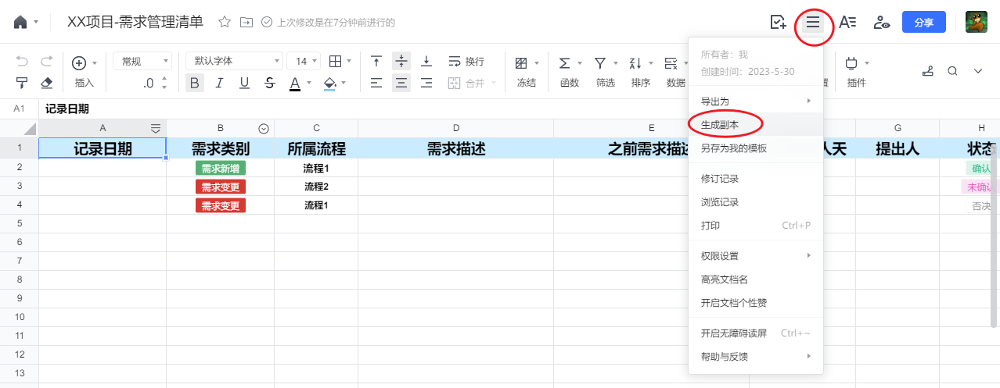
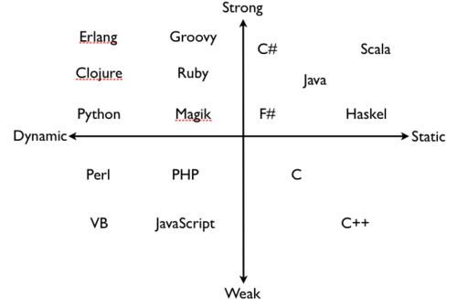

目录

- [1. 前言](#1-前言)
- [2. 基础概念](#2-基础概念)
  - [2.1. 典型的RPA项目过程](#21-典型的rpa项目过程)
  - [2.2. 名词解释](#22-名词解释)
- [3. 需求变更控制（需求管理）](#3-需求变更控制需求管理)
- [4. 风险管理](#4-风险管理)
  - [4.1. 风险识别](#41-风险识别)
  - [4.2. 风险跟进](#42-风险跟进)
  - [4.3. 常见风险概述（待更新）](#43-常见风险概述待更新)
- [5. 干系人管理](#5-干系人管理)
- [6. 程序设计](#6-程序设计)
  - [6.1. 流程图](#61-流程图)
  - [6.2. 命名规则](#62-命名规则)
  - [6.3. 模块划分](#63-模块划分)
    - [6.3.1. 模块划分总体原则——高内聚、低耦合](#631-模块划分总体原则高内聚低耦合)
    - [6.3.2. 模块划分的好处](#632-模块划分的好处)
    - [6.3.3. 划分模块时的考量因素](#633-划分模块时的考量因素)
    - [6.3.4. RPA软件中可以用于划分不同层级模块的功能](#634-rpa软件中可以用于划分不同层级模块的功能)
  - [6.4. 错误捕获与重试（待更新）](#64-错误捕获与重试待更新)
  - [6.5. 库的使用（待更新）](#65-库的使用待更新)
  - [6.6. 日志（待更新）](#66-日志待更新)
- [7. 许可证](#7-许可证)

# 1. 前言

嗨，这里是我的RPA项目管理笔记，以总结分享个人在RPA项目过程中的管理经验为主，也会包含少量技术经验。

目前个人接触过的RPA软件包括UiBot，Encoo，UiPath，由于不同软件的特性会导致某些管理经验的适用性不同，对于这种情况，我会特别标注出来。

本人在小型乙方公司中参与中小型项目开发，管理经验来自于个人书本学习和项目完成后的反思总结，因此无法适用于所有RPA业务场景，很多观点甚至可能是偏颇的，请见谅。个人估计本笔记对中小型企业的RPA从业者的帮助会更大些。笔记中所涉及各种场景，也主要从乙方工程师的视角来阐述（所以笔记中一般「我方」就等于「乙方」，「对方」就等于「甲方」）。

如果读者有任何疑问或意见，欢迎在本笔记发布的平台留言，我会尽量给予有建设性的回复。

希望达成的目的：

* 记录与展示个人的工作、学习成果，帮助职业发展；
* 帮助经验尚浅的RPA从业者避免一些弯路（一些对于初中级工程师可能比较陌生的词，我会在括号内给出简短解释；以及有时担心讲得不够浅显，文字有些啰嗦，请见谅）；
  * 个人认为，管理也是一门技术，纯开发的技术工程师应当掌握一定的管理知识，获得在沟通、效率、协作、决策上的好处，使自己的项目过程愉快一些。
* 锻炼自己的英文写作。

RPA行业还在高速发展中，如果随着时间发展，本笔记可以在此行业留下一些痕迹，帮助到一些工程师，那将会是一件十分有成就感的事情。（如果在此之前，大部分RPA岗位已经被通用AI取代，那只能祝我们好运了）

本笔记在以下三个平台发布：

* GitHub（中文）：[https://github.com/HUHARED/rpa_project_management_notes/blob/main/README.md](https://github.com/HUHARED/rpa_project_management_notes/blob/main/README.md)
* UiBot社区：[https://forum.laiye.com/thread-30110.htm](https://forum.laiye.com/thread-30110.htm)
* GitHub(English)：[https://github.com/HUHARED/rpa_project_management_notes/blob/main/README_en.md](https://github.com/HUHARED/rpa_project_management_notes/blob/main/README_en.md)
* UiPath Forum：[https://forum.uipath.com/t/my-rpa-project-management-notes/541120?u=huha](https://forum.uipath.com/t/my-rpa-project-management-notes/541120?u=huha)

在我认为值得分享的管理知识枯竭之前，计划本笔记每月至少更新2次，总字数2万+。

本笔记的更新以GitHub为主，并适时同步到其他平台。

欢迎在以上平台进行留言讨论，谢谢。

如果读者对UiBot技术方面感兴趣，也可阅读本人的UiBot技术笔记：[【笔记分享】个人UiBot使用经验、笔记、技巧分享](https://forum.uibot.com.cn/thread-12458.htm)

# 2. 基础概念

为了使未专门接触过项目管理的RPA工程师能更好的理解接下来的内容，我们先来了解一些基础概念。

受限于个人经验，笔记中对于这些基础概念的解释，可能与专业领域的定义有一些差别。

## 2.1. 典型的RPA项目过程

1. 项目启动之前
   1. 在项目经理了解到这个项目之前，公司的销售、市场团队通常已经完成了对潜在客户的调查研究、意向洽谈等工作。
2. 项目启动
   1. 项目经理、业务分析人员、程序设计人员、程序实施人员、客户等等干系人通过邮件、聊天软件、视频会议等工具，分析、明确这个项目的任务范围（要做哪些事情，做到什么程度）、需要哪些资源（人力资源、软硬件资源等）、可能存在什么风险、报价（常见的有固定价格、按每个周期人天计费等）等等。
3. 业务分析、程序设计
   1. 对要自动化的业务进行详细分析，构建流程图等，做出程序总体、细节设计。
4. 程序实施、测试
   1. 实施工程师根据程序设计资料进行RPA程序的实施工作。
   2. 按照我所接触的情况而言，通常测试工作也由实施工程师负责。
5. 部署和系统测试
   1. RPA程序通过了在开发环境的集成测试后，就需要在客户执行的实际生产环境进行部署了，包括安装RPA软件、浏览器、Excel等。
   2. 部署完成后，在实际生产环境运行整体程序，观察运行结果是否符合预期，也就是系统测试。
6. 用户培训、产品验收
   1. 如果系统测试没问题，根据需要，可能需要为客户进行程序日常使用、维护的培训，而如果客户自己没有IT人员，可能会要求将产品后续的长期运维也交于我方，自然也就不牵扯到培训工作。
   2. 当用户确定对我方提供的程序满意，则双方进行产品验收工作，包括对验收报告签字，按合同约定打款等。
7. 经验总结
   1. 项目团队内部总结本次项目过程中各种管理、技术方面经验，形成文档资料供后续同类项目参考。
8. 程序运维
   1. 如果约定了提供运维服务，那么在约定的运维周期内，由运维工程师（通常也可能是实施工程师担任）进行程序的日常运维工作，通常包括
      1. 业务流程涉及的界面如果发生了影响程序运行的变化，对程序的界面操作逻辑进行修改；
      2. 程序要处理的数据格式发生了变化，对数据处理逻辑进行修改；
      3. 客户对程序有新的需求，如果需求很容易实现，那么在运维工程师的权限范围内，可以直接修改程序，满足客户需求，如果需求可能要花费很多成本（占用较多时间、人力来进行分析、实施工作），则可能需要商务人员介入，沟通是否要签订增补合同，收取额外费用。
   2. 运维周期将要结束时，联系相关干系人，询问运维延期还是按照预期时间停止运维。

## 2.2. 名词解释

* 人天：项目工作量的一种计量方式，通常指一个工程师在8个小时（法定的一天工作时长）可完成的工作量。
* 单元测试：对程序代码中一小部分（比如UiBot的一个子程序、流程块，UiPath和Encoo的一个子流程、序列）进行测试。目的是验证当前这部分代码的功能是否正确。
* 集成测试：将单元测试通过的组件组合在一起进行测试，看它们能否正确的协同工作。
* 系统测试：在程序预期要运行的系统中，对整个程序进行全面测试，观察程序是否能满足预期的需求。
* 用户验收测试：在RPA程序交付之前，由实际用户进行的测试。观察程序能否让客户在真实的业务场景中正常工作。
* 甲方：指的是项目过程中提出需求、付钱的客户公司、人员。
* 乙方：指的是项目过程中满足甲方需求、收钱的公司、人员。

# 3. 需求变更控制（需求管理）

项目开发过程中，可能遇到客户新增、变更需求的情况，高效的项目管理过程应当注重对客户提出的需求变更进行控制。

在说明原因之前，我们应该了解以下前提：

* 甲乙双方约定的项目报价，很多情况下是以人天为单位计算出来的，比如一个项目涉及到一个产品经理、若干个高级工程师、若干个中级工程师，计算分别需要花费每个人员多少天的时间，然后给出一个具体报价、约定什么时间给出最终产品。
* 在明确了任务总体范围之后，才能做出相对合理的人天估算。
* 在甲方确认项目约定的任务已完成之前，乙方实际花费的人天越少，自然盈利越多。

那么，之所以要进行需求变更控制（避免直接接受客户所提出的需求变更），可以概括为以下原因：

* 保持项目范围明确、降低风险：
  * 项目范围的增加意味着要付出额外的人天成本，且新需求之前可能没有进行过可行性验证，那么可能带来未知风险，增加乙方所承担的成本（降低了盈利）。
* 确保项目不偏离计划时间、保持项目质量、提高客户满意度：
  * 需求变更可能意味着之前进行的程序设计工作要进行额外改动，影响项目最终成果的预期质量、预计完成时间。
  * 对需求变更可能存在的新风险、导致项目上线时间推迟、需求本身的可行性等与客户进行沟通，获取客户的理解和支持，避免减少客户对我方感到不满的可能性。
* 保持团队士气：
  * 频繁的需求变更可能导致我方团队士气低落，因为成员可能感到自己的努力被浪费。

那么在了解到进行需求变更控制的必要性之后，可参考以下步骤进行需求变更控制工作：

1. 在项目启动阶段，约定甲乙双方有权提出需求变更、有权确定需求变更的人。
   1. 为了避免随便什么人都对项目指手画脚，干扰项目高效运行，有必要在项目前期就明确相关权责。
   2. 由专人进行沟通，可以减少多方联络时，因为对项目的业务、技术了解情况不同而造成的额外沟通成本。
   3. 人选标准建议：
      1. 甲方的有权提出需求变更的人员，通常建议选择熟悉本项目所涉及的各种业务的人员，或者与相关业务人员能进行有效沟通的人。这样主要是为了减少在用户验收测试阶段，程序使用者发现程序在真实业务场景下与自己的预期效果差距大的可能性。
      2. 甲方的有权提出需求变更的人员，通常建议选择被客户方领导授权过的业务人员，或者客户方领导。
      3. 乙方有权提出、确认需求变更的人员
         1. 如果是中大型项目，需要多个实施工程师同时负责不同业务模块的实施，则建议是专门指派一个人，作为需求专员。需求专业在项目前期负责与甲方沟通，编写需求文档，实施工程师根据程序设计文档、需求文档实施时如果遇到问题（比如某些需求不够清晰、难以实现），首先与需求专员进行沟通，需求专员完全理解了之后，需求专员再与客户需求控制人员沟通。
         2. 如果是小型项目，则可以由实施人员兼任需求沟通、确认工作。
2. 明确变更的代价
   1. 每次提出需求变更，我方都要和对方明确这个变更可能付出的代价：
      1. 时间成本
      2. 对程序质量的影响
      3. 可能遇到未知风险导致交付时间延误等
   2. 明确阐述代价不是为了要客户额外付费（当然有额外付费更好），而是要为可能因需求变更导致的程序质量问题、延期获取客户的理解，即使需要额外付费，或者项目效果未达到预期，客户一般能一定程度上体会到我们的苦劳。
3. 记录需求变更到文档
   1. 还在沟通过程中、已经确认要进行的、已经确认取消的需求变更，都要尽量记录到文档中，出现矛盾后可作为评判责任的依据。
   2. 建议优先使用聊天软件提供的在线文档，方便各方查阅、编辑，最后也可作为项目交付文件。
   3. 文档格式可参考下面的表格自行创建，或将这个在线腾讯文档（[【腾讯文档】XX项目-需求管理清单](https://docs.qq.com/sheet/DR2hDVWlNRlJoQWtB?tab=BB08J2)）创建副本到自己的帐号中：

| 记录日期       | 类别     | 所属流程 | 需求描述 | 之前需求描述 | 预估消耗人天 | 提出人 | 状态   | 确认人 | 备注 |
| -------------- | -------- | -------- | -------- | ------------ | ------------ | ------ | ------ | ------ | ---- |
| 20XX年XX月XX日 | 需求新增 | 流程1    |          |              |              |        | 确认   |        |      |
| 20XX年XX月XX日 | 需求变更 | 流程2    |          |              |              |        | 沟通中 |        |      |
| 20XX年XX月XX日 | 需求变更 | 流程2    |          |              |              |        | 否决   |        |      |

# 4. 风险管理

## 4.1. 风险识别

任何可能导致项目的目标（包括范围、时间、成本、质量）偏离预期的事情，都算是风险。

给风险分类的话，则包括技术风险（软件兼容性、实施难度等）、业务风险（如业务流程变更、合规性等）。

对待风险的正确态度是尽量提早识别风险并制定应对措施，因为越是到项目后期再发现新问题，导致的损失往往越大。

为了提早识别项目风险，制定风险对应措施，减少因风险导致的返工、项目拖延问题，可以参考该风险核对单，根据项目场景，来了解之前同类项目遇到过哪些风险、有什么应对措施。

风险核对单应该是随着公司发展不断补充修订的，建议每次项目完成后都通过团队内部召开会议等方式总结风险识别和应对过程，更新风险核对单。

风险核对单文档格式可参考：

| 更新日期       | 场景一级分类 | 细分场景             | 需注意风险说明                                                                                                                             | 参考项目     | 参考应对措施                                                                                                                                                                                                                                                                                                                  | 编辑人 |
| -------------- | ------------ | -------------------- | ------------------------------------------------------------------------------------------------------------------------------------------ | ------------ | ----------------------------------------------------------------------------------------------------------------------------------------------------------------------------------------------------------------------------------------------------------------------------------------------------------------------------- | ------ |
| 20XX年XX月XX日 | 登录         |                      | 需注意登录是否需要手机、邮箱来接收验证码                                                                                                   |              | 手机验证需要客户在手机上安装APP，并在服务器上部署验证码收发程序（如果手机不在内网环境，则还需要服务器有公网IP），客户可能不愿意手机安装软件，以及总体而言工作量比邮件方法大，且部分手机系统对验证码监听软件兼容性差。 因此优先建议客户改为邮箱验证，需注意邮箱需要支持协议连接（有的客户因网络管理要求，不允许协议链接） | 某某   |
| 20XX年XX月XX日 | 登录         | 抖音平台抖店网页登录 | 登录帐号时，可能需要滑块拼图验证。                                                                                                         | 某某电商项目 | 使用Python的OpenCV库计算滑动偏移值。具体参考技术文档知识库。                                                                                                                                                                                                                                                                  | 某某   |
| 20XX年XX月XX日 | 登录         | 抖音平台抖店网页登录 | 登录帐号时，可能需要手机或邮箱验证码                                                                                                       | 某某电商项目 | 单一客户帐号，则在保持每天都访问网页的情况下，一般不会自动退出帐号，也就不涉及验证码问题。 如果必须使用帐号密码登录，建议使用邮箱作为用户名，获得邮箱密码，使用IMAP协议连接邮箱来获取验证码。                                                                                                                            | 某某   |
| 20XX年XX月XX日 | 数据库       | 数据库连接           | 需要注意客户提供的数据库是否需要通过SSH通道等方式进行连接，RPA软件内置组件不支持。                                                         | 某某电商项目 | 使用Python的sshtunnel库                                                                                                                                                                                                                                                                                                       | 某某   |
| 20XX年XX月XX日 | 沟通         | 客户无专职IT         | 当客户没有专职IT时，出现云服务器、第三方网站等问题时，如果让客户对接人进行联系相关客服沟通（一般是个业务领导或业务员），可能沟通效率非常低 | 某某电商项目 | 对应这种情况，如果时间紧张，建议经客户授权、规避其他责任风险后，由我方联系相关第三方服务商客服。                                                                                                                                                                                                                              | 某某   |

项目启动阶段，应该联系相关干系人，使用参考风险核对单、询问干系人意见等方式，产生本项目的风险登记表，来记录、追踪项目风险。

制定具体的风险应对措施时，通常从以下几方面考虑：

* 规避：改变项目计划，使风险本身不可能出现。
* 降低：采取措施减少风险发生时的影响，或降低风险发生概率。
* 转移：将风险转移给第三方，比如保险、合同分包等。
* 接收：有意识的接受风险，并为可能的影响做好准备。

制定好风险对应措施后，指定责任人，确保有专人负责监控和管理对应风险，并根据项目实际进展来调整风险应对措施。

风险登记表文档格式可参考：

| 创建日期 | 更新日期 | 是否关闭 | 风险说明 | 风险影响 | 应对措施 | 责任人 |
| -------- | -------- | -------- | -------- | -------- | -------- | ------ |
|          |          | 关闭     |          |          |          |        |
|          |          | 未关闭   |          |          |          |        |

或者将这个在线腾讯文档（[【腾讯文档】XX项目-风险跟踪表](https://docs.qq.com/sheet/DR1lBckFNc0VBd3VY?tab=BB08J2)）创建副本到自己的帐号中。

## 4.2. 风险跟进

在整个项目过程中，都要持续监控已经识别的风险和对应措施的执行情况。

项目管理人员可以通过定期项目会议、报告等方式，确保风险管理信息被及时更新和通知到相关干系人，并识别新出现的风险，将其更新到风险登记表中。

在项目结束后，对本次项目风险管理过程进行评估，总结经验教训，将可以用于后续项目的处理方案记录到风险核对表等文件中。

## 4.3. 常见风险概述（待更新）

# 5. 干系人管理

当项目中各方涉及人数大于等于5个人时（举例来说，一个项目最少会有这4个人：甲方领导、甲方业务员、我方商务、我方RPA工程师），人数越多，越有必要整理出一份干系人清单。

干系人清单对项目中途接手、加入的人来做作用很大：

* 了解本项目中不同人的姓名（或称呼）
* 明确每个人的权责（哪方面有问题该找谁）。
* 记录联系方式（微信、电话、邮箱等）。
* 记录干系人的性格、有效交流方式、沟通雷区。
  * 比如某些甲方的领导特别厌恶工程师对Ta说「这个肯定做不到、这不是我的工作」，如果还打算和对方合作的话，就需要避免这种雷区。

干系人清单文档格式可参考：

| 干系人类别       | 干系人名称 / 称呼 | 干系人职责 | 联系方式 | 备注 |
| ---------------- | ----------------- | ---------- | -------- | ---- |
| 客户方领导       |                   |            |          |      |
| 客户方业务员     |                   |            |          |      |
| 客户方IT         |                   |            |          |      |
| 合作商领导       |                   |            |          |      |
| 合作商IT         |                   |            |          |      |
| 内部团队领导     |                   |            |          |      |
| 内部团队成员     |                   |            |          |      |
| 内部团队项目管理 |                   |            |          |      |

或者将这个在线腾讯文档（[【腾讯文档】XX项目-干系人登记表](https://docs.qq.com/sheet/DR0JHR1BodnlJY1Nx?tab=BB08J2)）创建副本到自己的帐号中。

# 6. 程序设计

## 6.1. 流程图

除非是个人使用的临时的、小工具性质的程序，否则都建议将画流程图作为「理清需求」之后、「程序设计」之前的过程。

流程图可粗可细，可选软件或网站也很多（Microsoft Visio、Draw.io、亿图图示、processon，或者手绘当然也是一个选择），只要能够方便自己、其他干系人分享、理解就行。

在写RPA程序之前，先画流程图的普遍意义是这样的：

* 自己梳理需求：对需求所对应的程序操作步骤、数据流转有比较概括的梳理，有助于理解需求、发现现有需求分析中还不明确的地方。
* 使别人理解程序的运作过程：和单纯的文字、语言沟通相比，使用流程图通常有助于对方更快的理解自己想要表达的意思。
* 作为项目书面资料：
  * 项目完成后，如果要将程序交给其他工程师运维，有关于程序框架、不同模块运行逻辑的流程图的话，会让接手程序的运维工程师更快的理解程序，减少运维成本
  * 很多乙方公司的业务团队会专注于某些具体的垂直领域，比如电商、物流、财务等等，那么不同的项目其实都有很多共性、程序很多部分可以经过少量修改后复用，那么在复用之前项目的程序时，有流程图就可以降低理解成本。

## 6.2. 命名规则

在说明RPA项目适合什么样的命名规则之前，我们需要先对不同编程语言对变量类型处理的「动态、静态」（Dynamic vs. Static）、「强、弱」（Strong vs. Weak）有个大概了解。

请参考知乎回答：[弱类型、强类型、动态类型、静态类型语言的区别是什么-哥舒夜带刀的回答](https://www.zhihu.com/question/19918532/answer/1090175567)

注意这不是精确的技术定义、在不同场景下经常被混淆，觉得难以理解也没关系，而且每种编程语言即使被归类为某一种类型，也不代表着它具备所有的类型特征。

图片出处：[Should Your Start Up Go Static or Dynamic?](https://dustyprogrammer-blog.tumblr.com/post/16746798643/should-your-start-up-go-static-or-dynamic)

然后，我们再来了解一下有哪些常见的命名风格：

* 驼峰命名法：每个单词之间没有间隔，通过每个单词的首字母大写来区分。
  可以再细分为大驼峰（CamelCase）、小驼峰（camelCase），后者的第一个单词首字母是小写。
  大驼峰命名法也就是PascalCase。
* PascalCase：包括第一个单词在内，所有单词首字母都大写。
* 蛇形命名法（snake_case）：所有单词之间使用下划线（ _ ）来连接。
* 烤串命名法（kabab-case）：所有单词之间使用短横线（ - ）来连接。

一些好的命名习惯：

* 在命名参数时，体现参数的传递方向（如果读者对参数和变量的区别不清楚，那么可以简单的理解「传给函数、函数返回的变量，就是参数」）。
  在UiPath、Encoo中保持这种命名习惯会有利于检查代码。
  UiPath、Encoo中的参数传递方向有3种，推荐在变量开头使用这几种文本：

  * in：表示这个参数是调用xaml文件时传入的。
  * out：表示这个参数是xaml文件运行完成时传出的。
  * io：表示这个文件被传入后又被传出。
* 使用有意义的名字：当我们创建变量时，RPA软件会给出「result、text、sRet、object」等名称，这些名称的含义过于宽泛了，如果我们将代码给别人解释，或者自己过几个月需要运维自己的代码，那么这种名称就不利于快速理解变量的作用。
  应当给变量 / 参数一个有清晰含义的名称，比如：学生姓名、总薪资、studentName、totalSalary。
* 在命名中提现变量 / 参数的类型：对于UiPath、Encoo这种基于VB / C#，对变量类型绑定有严格限制的RPA软件，建议在命名中包含提现类型的文本，有助于理解程序、减少类型冲突错误（而UiBot对更改变量类型绑定无限制，所以本条命名习惯的重要性不高），比如：

  * 字符串类型

    * strWebText
    * 网页文本
    * strName
    * 姓名文本
  * 整数类型

    * intTotalCount
  * 字典类型

    * dictConfig
    * 配置字典
  * 布尔值类型

    * isAvailable
    * hasPaid
    * canExecute
    * 是否元素存在
    * 是否已完成
    * 是否包含目标文本

一些应当避免的命名坏习惯

* 避免使用软件保留的关键字：如Int、Double、String等。
* 避免使用特殊字符：现在很多RPA软件都支持在变量、函数名称中使用UTF8字符，但是为了避免兼容性问题，还是建议优先使用常用汉字、ASCII字符命名字符。
* 避免使用汉语拼音：使用汉语拼音命名太难以理解、容易产生歧义、和英文单词混淆，如果读者的英文不好，就使用汉字命名即可，常见的RPA软件都支持，笔者个人实在是想不到什么合理的理由去使用汉语拼音。

UiBot很大程度上是基于Python二次开发的，UiPath、Encoo很大程度上是基于C#二次开发的，因此我们就可以根据Python、C#的不同特性，来区分使用不同RPA软件时，优先选择的命名习惯。

在这里给出我个人的命名习惯供读者参考：

* UiBot
  * variables: lowerCamelCase
  * arguments: direction(g/in/out)+lowCamelCase
  * functions: snack_case
  * blocks: UpperCamelCase
* UiPath/Encoo
  * variables: lowerCamelCase(withType)
  * arguments: direction(in/out/io)+lowCamelCase(withType)
  * functions: snack_case
  * folders: UpperCamelCase

## 6.3. 模块划分

在进行具体的RPA代码编写之前，为了使程序有一个清晰的结构，降低复杂度和出错后的调试成本，我们应当按照从顶层到底层的方向，从不同层级规划我们的程序包含哪些模块。

### 6.3.1. 模块划分总体原则——高内聚、低耦合

即模块内部的功能应该尽可能的紧密相关，不同模块之间的依赖关系应该尽可能的简单。

### 6.3.2. 模块划分的好处

* 使程序具备良好的可维护性、可扩展性
  * 因为模块之间彼此独立，某一层不需要知道它的下一层是如何实现的，只要按照约定进行调用即可。模块内部只需要考虑自己负责的功能，按照合适的方式解决。
  * 当某个模块内部尽快修改时，只要接口关系不变，那么调用它的模块就不会受到影响，不需要一起修改。
  * 某个模块不再需要时，可以直接去掉它。
* 方便进行单元测试
  * 问题在越小的模块、越早期被发现，解决成本就越低，当问题只能被定位到模糊的大范围内、在项目后期被发现，解决成本就越高。
* 促进标准化
  * 很多乙方公司的业务团队会专注于某些具体的垂直领域，比如电商、物流、财务等等，不同的项目其实都有很多完全一致的需求，那么就可以将对应功能的接口标准化，封装到功能库中（UiBot叫做命令库、UiPath叫做Library、Encoo叫做组件库），新项目可以直接调用。
* 有利于团队间分工开发

### 6.3.3. 划分模块时的考量因素

* 上游过程产生的流程图、需求设计文档。
* 功能划分
  * 根据业务流程中不同功能，来进行模块划分。比如一个电子邮件管理RPA程序，可能就会有「读取邮件」、「筛选邮件」、「发送邮件」几个功能。
    那么我们就可以考虑在UiBot的不同流程块、UiPath / Encoo的不同文件夹或xaml中实现上述功能。
* 数据类型划分
  * 比如一个RPA程序需要对不同类型的订单文件进行处理，那么我们可以将每种类型的数据处理过程放到对应的函数、文件夹中。
* 先后步骤划分
  * 按照业务流程的先后顺序，将整个程序划分为一系列的模块。
* 涉及软件划分
  * 比如一个RPA程序要对网页、客户端、数据库、Excel等进行操作，那么就可以将先划分文件夹，然后将不同软件的操作过程放到对应文件夹中。
    对于UiPath / Encoo这样内置文件夹架构的RPA软件来说，这很好理解，而UiBot则可以让一个内部定义了若干函数（子流程）的流程块充当文件夹。
* 是否被多次使用
  * 被多次使用的功能、步骤，尤其应该被封装为函数。

### 6.3.4. RPA软件中可以用于划分不同层级模块的功能

RPA工程师们可根据需要使用，越靠前的功能通常对应更顶层的模块划分。

* UiBot
  * 流程块（注意流程块内的函数（子程序）是可以被其他流程块调用的，调用方式：源代码视图中，**返回值=流程块名称.子程序名称(参数)**）
  * 函数（子程序）
* UiPath / Encoo
  * 文件夹
  * xaml
  * 流程图 / 序列

## 6.4. 错误捕获与重试（待更新）

## 6.5. 库的使用（待更新）

## 6.6. 日志（待更新）

# 7. 许可证

[MIT License](./LICENSE "开源许可证")
