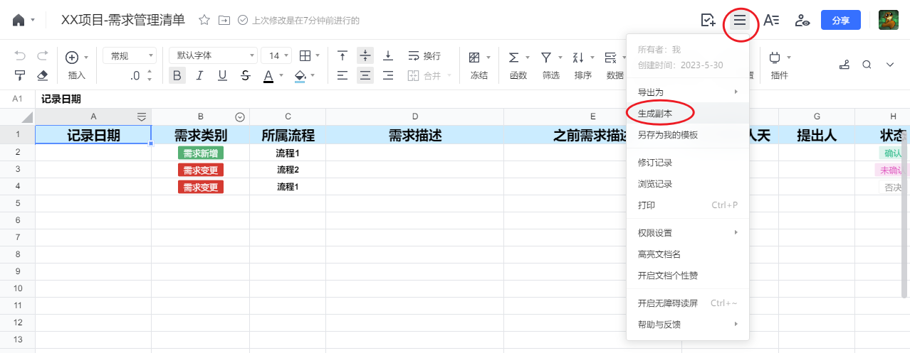
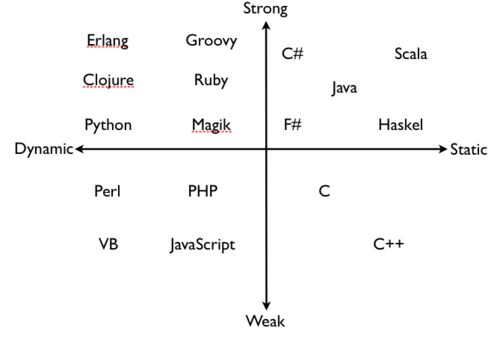

Catelog

- [1. Proface](#1-proface)
- [2. Basic Concepts](#2-basic-concepts)
  - [2.1. The Typical Duration of RPA Projects](#21-the-typical-duration-of-rpa-projects)
  - [2.2. Explanation of Terms](#22-explanation-of-terms)
- [3. Requirements Management](#3-requirements-management)
  - [3.1. Requirements Change Control](#31-requirements-change-control)
  - [3.2. Notes on Requirements Analysis](#32-notes-on-requirements-analysis)
- [4. Risk Management](#4-risk-management)
  - [4.1. Risk Identification](#41-risk-identification)
  - [4.2. Risk Follow-up](#42-risk-follow-up)
  - [4.3. Overview of Common Risks (to be updated)](#43-overview-of-common-risks-to-be-updated)
- [5. Stakeholder Management](#5-stakeholder-management)
- [6. Program Design](#6-program-design)
  - [6.1. Flow Chart](#61-flow-chart)
  - [6.2. Naming Rules](#62-naming-rules)
  - [6.3. Module Division](#63-module-division)
    - [6.3.1. The Fundamental Principles of Module Division: High Cohesion, Low coupling](#631-the-fundamental-principles-of-module-division-high-cohesion-low-coupling)
    - [6.3.2. Benefits of Module Division](#632-benefits-of-module-division)
- [7. License](#7-license)

# 1. Proface

Hi, these are my notes on RPA project management. They are designed to summarize and share my management experiences, while also incorporating a bit of technical expertise.

So far, I have used UiBot, Encoo, and UiPath. The applicability of my notes may vary due to differences in RPA software, so I will try to highlight any software-specific situations.

I've been responsible for develping small and medium-sized project at a small party B company. These management experiences are a reflection and summary of my studies and project, so it could not be applicable to all situations, and some opinions might be biased, please forgive me for that. I guess the notes will be more useful for RPA practitioners working in small to medium-sized companies. The scenarios discussed in the notes are primarily from the perspective of a party B engineer. (Hence, in the notes, generally "we" generally refers to the "party B" and "the other party" refers to the "party A")

If you have any questions or opinions, feel free to leave a comment on the platforms where the notes are published. I'll do my best to provide constructive responses.

My targets:

* To document and share the insights gained from my work and studies, ultimately supporting my own career growth.
* To help RPA practitioners (especially junior engineers ) avoid common piffalls. (I'll provide explainations in brackets for terms that may be unfamiliar to junior engineers. Additionally, I might over-explain at times to ensure clarity for readers, and I apologize in advance for that.)
  * In my view, management is a form of technology, a pure technical engineer can benefit from learning from some management knowledge. This can improve communication, efficiency, teamwork, decision-making, ultimately leading to a more enjoyable project experience.
* To practice my English writing skills.

The RPA business is still expanding rapidly, if the notes could make a small impact in the field, and help some engineers along the way, that would be a wonderful achievement. (if, however, most RPA positions are replaced by general AI before that happens, I just wish us good luck.)

The notes are published on the following platforms:

* GitHub (Chinese):[https://github.com/HUHARED/rpa_project_management_notes/blob/main/README.md](https://github.com/HUHARED/rpa_project_management_notes/blob/main/README.md)
* UiBot forum:[https://forum.laiye.com/thread-30110.htm](https://forum.laiye.com/thread-30110.htm)
* GitHub (English):[https://github.com/HUHARED/rpa_project_management_notes/blob/main/README_en.md](https://github.com/HUHARED/rpa_project_management_notes/blob/main/README_en.md)
* UiPath forum:[https://forum.uipath.com/t/my-rpa-project-management-notes/541120?u=huha](https://forum.uipath.com/t/my-rpa-project-management-notes/541120?u=huha)

Before exhausting the management knowledge I think is worth sharing, I plan to update the notes at least twice a month, with a total word count of over 20,000 words.

The notes will primarily be updated on GitHub, and then synchronized to other platforms at a convenient time.

Fell free to leave comments on the privously mentioned platforms. Thank you.

If you're interested in UiBot skills, you can check out my UiBot notes: [【笔记分享】个人UiBot使用经验、笔记、技巧分享](https://forum.uibot.com.cn/thread-12458.htm)

# 2. Basic Concepts

To help RPA engineers who never studied management understand the following content, let's first go over some basic concepts.

Dui to the limitations of my experiences, the explanations of these basic concepts might differ slightly from those provided by professionals.

## 2.1. The Typical Duration of RPA Projects

1. Before a project started

   1. Before the project manager learns about the project, the sales and marketing team have already completed the research and comunicated with the potential client.
2. Start the project

   1. The Project Manger, Business Analyst, Program Designer, Implementation Engineer, Client, and others will analyze and define the scope of the task (what needs to be done and how the result should be), determine the required resources (such as human resources, software, hardware), identify potential risks, determine how much to pay (common options are a fixed payment or payment based on man-days), and discuss other project-related details using tools like emails, instant messaging software, and video conferencing software.
3. Business Analysis and Program Design

   1. We will analyze the business that are to to be automated, create workflow diagrams, and develop both high-level and detailed program designs.
4. Implementation and Testing

   1. The Implementation Engineer develops the program based on the program design documents. From my understanding, the Implementation Engineer is typically responsible for conducting testing (including Unit Testing and Integration Testing) as well.
5. Deployment and System Testing

   1. After the RPA program had passed Integration Testing in the development environment, it needs to be deployed in the product environment, which typically involves installing the RPA software, browser, and Excel.
   2. Once the deployment is complete, we need to test the program in the product environment, also known as System Testing.
6. Customer Training and Product Acceptance

   1. If the System Testing is completed, depending on the client's needs, we may need to train them on how to use and maintain the program. If the Client doesn't have their own RPA Engineer, naturally, we do not need to provide training.
   2. Once the Client expresses their acceptance of the program, both parties proceed with the Product Acceptance, which includes signing the Product Accepance Ducuments and making payments according to the contract.
7. Experience Summary

   1. The Team compiles and summarizes the management and technical experiences gained during the project to create or update documents that can used as a reference for similar projects in the future.
8. Program Maintenance

   1. If the Program Maintenance service was promised in the contract, then, during the agreed-upon maintenance period, the Maintenance Engineer (who may also be the Implementation Engineer) will be responsible for:
      1. Adapting the UI operation logic if any changes in the UI related to the business process affect the normal functioning of the program;
      2. Modifying the data manipulation logic if the data format has changed;
      3. Accommodating the client's new requirements if they are easy to complete and within the Maintenance Engineer's authority. The Maintenance Engineer can directly update the program to meet the client's needs. However, if the changes require significant effort (involving many analysis, design, and implementation), the sales team may need to be involved in signing an addendum to the contract and negotiating additional payment.
   2. As the Program Maintenance period nears its end, we need to contact the client to discuss whether to extend the maintenance period or to end the maintenance service.

## 2.2. Explanation of Terms

* Man-Days: A method used to measure the amount of work involved in a project. One man-day typically represents the workload of an engineer in an 8-hour workday (the legal length of a work day).
* Unit Testing: Testing a small part of the entire program (such a function, a block in UiBot, a workflow, a sequence, or a flowchart in UiPath and Encoo). The goal is to determine whether that specific part of the code is functioning correctly or not.
* Integration Testing: Combining the components that have passed Unit Testing to determine whether they can work together correctly.
* System Testing: Conducting a comprehensive test of the program in the environment it is intended to run in, in order to determine whether it meets all the requirements.
* User Acceptance Testing (UAT): Before delivering the program, the client tests it  to determine whether it functions in accordance with their expectations.
* Party A: The party that expresses their requirements and pays for the project during its duration.
* Party B: The party that fulfills Party A's requirements and receives payment during the project's duration.

# 3. Requirements Management

## 3.1. Requirements Change Control

During the development of a project, we may encounter situations that the client creates or  changes some requirements. An efficient management process should allocate some attention and time to managing those changes of the client's requirements.

Before I explain the reason, let's first acknowledge these prerequisites:

* The payment is agreed upob by both the Party A and Party B, and it's usually calculated using man-days. For example, a project involves a Project Manager, some Senior Engineer, and some Junior Engineer. We need to calculate how many days each engineer would work on the project, and then determine a specific payment and the deadline for delivering the final product.
* Once we determine the scope of the project, we could provide a reasonable estimate of the man-days required.
* Before Party A declares that the project is completed,  the fewer man-days Party B spends,  the greater the profit they gain.

Thus, the reasons we should manage requirement changes can be summarized as follows:

* Maintain clear project scope and reduce project risks

  * An increase in the project typically means that we need to spend more man-days than initially planned, and the new requirements may not have undergone any feasibility verification. As a result, this may introduce unknown risks and increase the costs for Party B (which translates to decreased profits).
* Ensure the project deadline isn't delayed, maintain the project quality, and enhance client satisfaction:

  * Requirement changes can lead to alterations in the previous program designs, affecting the final quality and deadline of the project.
  * Communicate with the client about the new risks, the potential for deadline delays, and the feasibility of requirement changes to gain their understanding and support. This will reduce the likelihood of the client feeling dissatisfied.
* Maintain team morale:

  * Frequent requirement changes can often lead to a decline in team morale,as team members may feel that their efforts are wasted.

Now that we have known the importance of Requirements Change Control, we can implement it as follows:

1. When the project starts, we identify the individuals from both sides who have the authority to propose and approve requirement changes.

   1. To prevent anyone from interrupting the project and hindering its efficient progress, it's necessary to establish the relevant rights and responsibilities at the beginning of the project.
   2. Communicating through designated individuals can help reduce the extra costs that may arise due to varying levels of knowledge between both parties during communication.
   3. Suggested criteria of individuals：

      1. The individual for raising requirements in Party A: It's generally recommended to select a person who is responsible for every aspect of Party A's business, or who can efficiently communicate with all relevant operational staff . This aims to reduce the likelihood that the user feels the program performance does not meet their expectations during the User Acceptance Testing (UAT) period.
      2. The individual responsible for deciding requirements in Party A: It's generally recommended to select a person who is authorized by the Party A Leader, or the Party A Leader themselves.
      3. The individual responsible for raising and determining requirements:

         1. For medium to large-sized projects requiring multiple implementation engineers, it's suggested to appoint a Requirements Specialist. The Specialist is responsible for communicating with the client and documenting the Requirements Book. The Implementation Engineers develop the program based on the Program Design and Requirements documents, if they encounter any questions (such as unclear or difficult-to-achieve requirements), they will communicate with the Requirements Specialist. After the Requirements Specialist fully understands the issue, the Specialist will communicate with the indivaidual responsible for Demand Management.
         2. For small-sized projects, it's acceptable of the Implement Engineer to take charge of requirements communication and determination.
2. Determine the cost of each requirement change

   1. Every time the Client raises some requirement changes, we should determine the cost for the change:
      1. Time cost
      2. Effects on program quality
      3. Potential unclear risks leading to a delayed deployment deadline
   2. Determining the cost is not for requesting additional payments (of course, obtaining more payments is better), but for gain the understaning and forgiveness from the Client for program quality issues and deadline postponements caused by requirement changes. Even if we request more payments or the project performance does not meet the Client's expectations, they generally understand the hard work to some extent.
3. Record every requirement change in documents

   1. For requirement changes that are still under discusstion, have been approved or have been denied, we should record them in documents to the extent possible. If conficts arise with the Client, these records can be serve as evidence for determining both sides' responsibilities.
   2. It's recommended to utilize online ducuments in instant communication software. They are easy for both sides to check, edit, and export as part of project delivery documents.
   3. The format for requirement change documents can be created by referencing the following template, or you can duplicate a copy from this online Tencent Document([【腾讯文档】XX项目-需求管理清单](https://docs.qq.com/sheet/DR2hDVWlNRlJoQWtB?tab=BB08J2)) to your own account:

| Record Date | Category             | Workflow   | New Description | previous Description | Man-days Estimate | Proposer | Status    | Confirmer | Notes |
| ----------- | -------------------- | ---------- | --------------- | -------------------- | ----------------- | -------- | --------- | --------- | ----- |
| 20XX-XX-XX  | Requirement Addition | Workflow A |                 |                      |                   |          | Confirmed |           |       |
| 20XX-XX-XX  | Requirement Change   | Workflow B |                 |                      |                   |          | Pending   |           |       |
| 20XX-XX-XX  | Requirement Change   | Workflow B |                 |                      |                   |          | Denied    |           |       |

## 3.2. Notes on Requirements Analysis

* We should thoroughly understand all business steps and confirm them with stakeholders
  * The process of requirements analysis must include active participation from client staff members who are familiar with the business details.
    During the requirements analysis phase, the Requirements Specialist in the RPA team should ducument the workflow charts and descriptions, and confirm them with the client, development engineers, and other stakeholders. Once these charts and description are determine to be clear, accurate, we can proceed the subsequent tasks.
  * If the business process lacks established human procedures to reference, then the tasks of requirements analysis should be carried out collaboratively by the Requirements Specialist, the Client, the Program Designer, the Implementation Engineer.
    They should analyze every step in detail ,particularly the uiser interface manipulation steps, which should be manually reviewd to avoid overlooking any important details, identify potential risk factors.
    Given that **identifying issues earlier reduces the cost of resolving them**, this is particularly crucial when we lack established human procedures or past similar projects to reference.
* We must ducument requiments files such as workflow charts, workflow descriptions
  * On one hand, these files can be utilize for determining responsibility;
  * On the other hand, they can serve as a reference for future similar projects.
* Pay attention on key words related to the scope of requirements
  * For instance, for words such as "all" or "whole", we must define the boundaries of time, quantity, etc.
    For example, in data scraping requirements, if the client says they need "all" data from a webpage, we need to ask the client to clarify whether "all" means "all result on the current page", or "all result that can be viewed by flipping through the pages", and whether the date scaping should be done up to yesterday or some other specific date.
* The format and storage method of input and output data should be clarified
  * We need to determine the data format that the RPA process need to handle, and where these data are coming from (e.g. data rows from SQL query, Excel, Email, etc.)
  * We alse need to determine the for that the RPA process will produce, and where these output data will be saved. (If the data if saved to folders, the rules for naming folders and files should be considered, including how to distinguish by data, account, etc.)
* Consider the requirements of similar project thoroughly
  * Past similar projects: During the requirements ayalysis phase, we should consider any requirements or issues that we encountered in past similar projects.
  * Future similar projects: We should also contemplate whether the scope and targets of requirements could be changed, so that if the team is assigned to a similar project in the future, they can better utilize the learnings and achievements from the current project.

# 4. Risk Management

## 4.1. Risk Identification

Any issue that increases the possibility that the project's outcomes deviating from expectations should be considered as a risk.

If we categorize risks, they can be recognized as technical risks (such as software  compatibility, implementation difficulty) and business risks (such as changes in business process or compliance requirements).

The appropriate approach to dealing with risks involves early detection and formulating corresponding countermeasures. This is curcial because the later a probelm is discovered, the higher the cost of addressing it.

For detecting risks early, formulating countermeasures and minimize rework and delay cause by risks, we can refer to the Risks Checklist. This allows us to understand the potential risks and countermeasures were encountered in similar projects and apply these learing to our current project.

The Risks Checklist should be continuously updated and revised as different projects completed. It is recommended that the RPA team regularly reviews the processes of identifying and responsing risks, and then updates the Risks Checklist.

The format for Risk Checklist can be created by refering the following template.

| Update Date | Scenario      | Sub-Senario | Risks Should be Identify | Reference Projects | Reference Countermeasures | Editor |
| ----------- | ------------- | ----------- | ------------------------ | ------------------ | ------------------------- | ------ |
| 20XX-XX-XX  | Log in        |             |                          |                    |                           |        |
| 20XX-XX-XX  | Log in        |             |                          |                    |                           |        |
| 20XX-XX-XX  | Log in        |             |                          |                    |                           |        |
| 20XX-XX-XX  | DataBase      |             |                          |                    |                           |        |
| 20XX-XX-XX  | Communication |             |                          |                    |                           |        |

During the project initiation phase, the Project Manager should engage with stakeholders, document the Risk Tracking Table by referencing the Risk Checklist, gathering stakeholders' opinions, etc. This will enable us to  systematically record and  tracking risks of the project.

Risk countermeasures usually include the following approaches:

* Avoid: Alter the project's plan to make the risk impossible to occur.
* Reduce: Implement countermeasures to reduce the impact of risks, or decrease its likelihood of occurring.
* Transfer: Shift risks to others, such as through insurance or subcontracting.
* Accept: Deliberately acknowledge the potential of risks to occur and prepare accordingly.

Once risk countermeasures are established, the Project Manager must assign each countermeasure to a responsible individual to oversee and manage it, These countermeasures should be adjusted as necessary to align the project's actual progress.

The format for Risk Tracing Table can be established by referencing the following table:

| Create Date | Update Date | Whether to Close | Risk Description | Risk Effect | Countermeasure | Responsible Individual |
| ----------- | ----------- | ---------------- | ---------------- | ----------- | -------------- | ---------------------- |
| 20XX-XX-XX  | 20XX-XX-XX  | Closed           |                  |             |                |                        |
| 20XX-XX-XX  | 20XX-XX-XX  | Not losed        |                  |             |                |                        |

Alernatively, you can copy the online Tencent Document ([【腾讯文档】XX项目-风险跟踪表](https://docs.qq.com/sheet/DR1lBckFNc0VBd3VY?tab=BB08J2)) to your own account.

## 4.2. Risk Follow-up

Throughout the whole duration of the project, We should consistently minitor the progress of risks identification and tracking.

The program Manager can regularly update risk management information and notify team members promptly through meetings, reports, etc. They should also continuously identify new risks and add them to the Risk Tracking Table.

Once the project is delivered, it is important to review and summarize experience from the project's risk management process, and update the Risk Checklist with any new countermeasures that could potentially be useful in future similar projects.

## 4.3. Overview of Common Risks (to be updated)

# 5. Stakeholder Management

When a project involves at least 5 individuals (for example, the minimum could be a team comprising of a  Party A Leader, a Party A Business Staff, our Salesperson and our RPA Developer), the significance of creating a Stakeholder List increases with the number of individuals involved in the project.

A Stakeholder List is particularly useful for individuals who are assigned to a project midway:

* It helps familiarize with each individual's name or title
* It helps clarify each individual's roles and responsibilities.
* It provides contact information (phone number, email, etc.)
* It records certain stakeholders' character traits, effective communication styles and potential  communication pitfalls
  * For Instance, some Party A Leaders may become upset when a developer says, "It's impossible, It's not my job". if we aim to continue woring with them, these potential areas of conflict must be avoid.

To generate a Stakeholder List, you can refer to the following Table:

| Stakeholder Category  | Name or Title | Roles | Contacts | Notes |
| --------------------- | ------------- | ----- | -------- | ----- |
| Client Leader         |               |       |          |       |
| Client Business Staff |               |       |          |       |
| Client IT            |               |       |          |       |
| Partner Leader        |               |       |          |       |
| Partner IT            |               |       |          |       |
| Internal Team Leader  |               |       |          |       |
| Internal Team Member  |               |       |          |       |
| Internal Team Manager |               |       |          |       |

Alternatively, you can copy the online Tencent Document ([【腾讯文档】XX项目-干系人登记表](https://docs.qq.com/sheet/DR0JHR1BodnlJY1Nx?tab=BB08J2)) to your own account.

# 6. Program Design

## 6.1. Flow Chart

It's recommended to generate flow charts after requirements have been defined and before the program design phase, unless the new project serves only as a temporary tool for personal use.

Flow charts can be either detailed or high-level, and there are numerous software and websites to choose (such as Microsoft Visio, Draw.io, EdrawMax, ProcessOn), or even hand-drawing can be an option. The key is to choose a method that is convenient for sharing and understanding.

The importance of generating flow charts prior to program implementation includes:

* Clarify requirements: Flow charts can aid in understanding the requirements more deeply and in identifying unclear requirements or risks by outlining all steps of the expected process.
* Help others understand the program procedure: Flow charts can often facilitate faster comprehension of out intentions than text and verbal explanations alone.
* Serve as written documentations of a project:
  * Upon delivery of the program, if it needs to handed over to other  engineers, having flow charts detailing the program's framework and each module's logic can help those engineers understand the procedure more quickly and can reduce maintenance costs.
  * Many teams on the vendor side specialize in specific business areas, such as E-commerce, Logistics, Finance, etc. Different projects within these areas often have many common aspects. Flow charts can help in capturing these commonalities and in reusing knowledge across projects.

## 6.2. Naming Rules

Before discussing which naming rule best suits to an RPA program, we should learn about the different ways various coding languages handle variable types, including dynamic vs. static and strong vs. weak.

Please reference the Zhihu answer: [弱类型、强类型、动态类型、静态类型语言的区别是什么-哥舒夜带刀的回答](https://www.zhihu.com/question/19918532/answer/1090175567)

It's important to note that it's not a strict technical definition and its meanings can often be interchanged or misunderstand in different contexts. It's okay if you find them difficult to understand. Furthermore, even if a coding language was categorized as a type, it doesn't mean that it embodies all characteristics of that typy.

Image source: [Should Your Start Up Go Static or Dynamic?](https://dustyprogrammer-blog.tumblr.com/post/16746798643/should-your-start-up-go-static-or-dynamic)

Then, let's learn some common naming conventions:

* camelCase: This convention doesn't use spaces between words, and distinguishes words by capitalizing the first letter of each word.
  It can be divided into two categories: UpperCamelCase (also known as PascalCase) and lowerCamelCase, where the first letter of the entire identifier in lowerCamelCase is lowercase.
* PascalCase: In this convention, the first letter of every word, including the first one, is capitalized.
* snake_case: Words are linked by underscore(_).
* kabab-case: Words are linked by hyphen(-).

Some good naming habits:

* When we name an argument, the argument's name should reflect the data transfer (If you're not clear about the difference between a variable and an argument, you can think of an argument as a variable that is passed into a function (or a .xaml file) or returned by a function.)
  Maintaining this habit aids in code inspection.
  In UiPath and Encoo, there are three directions of data transfer, it's recommended to indicate these prefixes in argument identifier:
  * in: This prefix indicates that the argument is passed into the .xaml file.
  * out: This prefix signifies that the argument is returned from the .xaml file.
  * io: This prefix expresses that the argument is passed into the .xaml file and then returned from the same .xaml file.
* Use a meaningful identifier: When we generate a variable (or an argument), RPA software will assign a default name automatically, such as *result, text, sRet, object, item*, etc. These default names are too vague to immediately understand. If we need to explain the code to others, or revisit our code several months later, these default name do not facilitate quick comprehension of the variable's role.
  Therefore, we should assign clear, meaningful names to our variables and arguments, such as *studentName, totalSalary.*
* Reflect the type of variables or arguments: RPA software that are based on VB, C# have strict rules for  binding type with variables (or arguments). To quickly understand program and reduce type conflict errors, it's recommended to include texts that reflect the variable's (or argument's) type in the identifier, such as:
  * String type
    * strWebText
    * strName
  * Int type
    * intTotalCount
  * Dictionary type
    * dictConfig
  * Boolean type
    * bExists
    * isAvailable
    * hasPaid
    * canExecute

Some poor naming practices we should avoid:

* Refrain from using reserved keywords: Such Int, Double, String, etc.
* Steer clear of special characters: Although many RPA tools is support the use of UTF-8 characters in identifiers, to avoid compatibility issues, it's advisable to only use ASCII characters and numbers.

To a large extent, UiBot is developed in Python, and UiPath, Encoo are developed in C# (or VB). Therefore, when we using different RPA tools, we can choose a naming conversion based on the characteristics of Python and C#.

Here are my naming conversions for reference:

* UiBot
  * variables: camelCase
  * arguments: directions(g/in/out) + camelCase
  * functions: snack_case
  * blocks: PascalCase
* UiPath/Encoo
  * variables: camelCase(with type)
  * arguments: direction (in/out/io) + camelCase(with type)
  * functions(.xaml): snack_case
  * folders: PascalCase

If an RPA program needs to retrieve data from a client's internal system via some APIs provided by the client's IT departments, we should early define the API name and argument rules with the client's IT teams and document them. This will help prevent conflicts in naming conventions during the development phase.

## 6.3. Module Division

Before we proceed with the implementation of the RPA program, to ensure the program has a clear structure and to reduce complexity and debugging efforts, we should plan the modules of the program in a top-down manner.

### 6.3.1. The Fundamental Principles of Module Division: High Cohesion, Low coupling

This means that the functions within a module should all serve the needs of a single objective, and the dependencies between different modules should be kept as minimal and straightforward as possible.

### 6.3.2. Benefits of Module Division

* Enhance the program's maintainability and expandability.
  * Due to the independence of each module, one layer doesn't need to know how the adjacent layer are implemented, it merely invokes or gets invoked by conventions. Each module simply accomplish its goal in an appropriate manner.
  * When a module needs modification, as long as the invoking interface remains the same, the modules that call upon it will not be affected, and will not require concurrent modification.
  * If a module becomes redundant, it can be removed directly.
* Facilitate unit testing
  * Issues can be identified and resolved more efficiently in a smaller modules. When an issue is vaguely localized within a large module, or detected at a later stage of the project, the resolution process tends to be more costly. This is why dividing the program into small modules facilitates unit testing and help mitigate potential issues early in the development process.
* Promote standardization
  * As previously mentioned, many teams on the vendor side specialize in specific business areas, such as E-commerce, Logistics, Finance, etc. Different projects within these areas often have many common aspects.
    Therefore, we can standardize the interfaces similar functions and package them into a Library (in UiBot, it's called Command Library; in UiPath, it's called Library, in Encoo, it's called Component Library). New projects can then directly utilize these prepackaged modules from the library.
* Facilitate work division within a team
  * When a large project is split into smaller, modular parts, it makes it easier to divide the work among team members. Each individual or subteam can focus on a specific module, promoting parallel development and speeding up the overall project timeline.
  * This division also aids in accountability as it's clear who is responsible for each module.

### 6.3.3. Factors in Module Division

* Previous Phase Outputs
  * Such as flow charts, requirement documents that generated in earlier stages of the project.
* Functional Areas
  * Divide modules according to distinct functions within the business process. For example, in an email management RPA program, there might be functions like "reading mails", "filtering mails", "sending mails".
    In light of this, we can consider implementing these in different blocks (in UiBot), or in different folders or .xaml files (in UiPath and Encoo).
* Data Types
  * For instance, an RPA program needs to manipulate some order files with different types, we can put each kind of manipulation for order files to different functions(or .xaml files) or folders.
* Sequence of Steps
  * Divide the entire program into a series of modules based on the sequential order of the business process steps.
* Software
  * For example, if an RPA program needs to interact with different web pages, client software, databases, and Excel files, we can initially create folders, and then place the respective processes for  each software into the corresponding folders.
    It's straightforward with some RPA tools that have a built-in folder architecture, like UiPath and Encoo. In UiBot, we can utilize a block that includes some functions as if it were a folder.
* Module Reusability
  * Steps that are utilized multiple times should be packaged especially.
* Module Complexity
  * The more steps that a module contains, the more necessary it becomes to to divide it into different submodules.
* Future Requirement Changes
  * If certain steps associated with a business are likely to change in the future, they should be disigned as a separate modules. This approach allows for easier modifications to adapt to new situations, reducing the need to modify extencice portions of the program.
* Team Members' Technical Proficiency
  * When working as a team on a program, it's advisable to avoid using technologies that other team members are unfamiliar with. This ensures that everyone can understand and implement the module designs.

# 7. License

[MIT License](./LICENSE "开源许可证")
